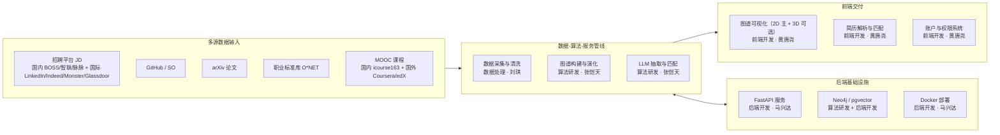
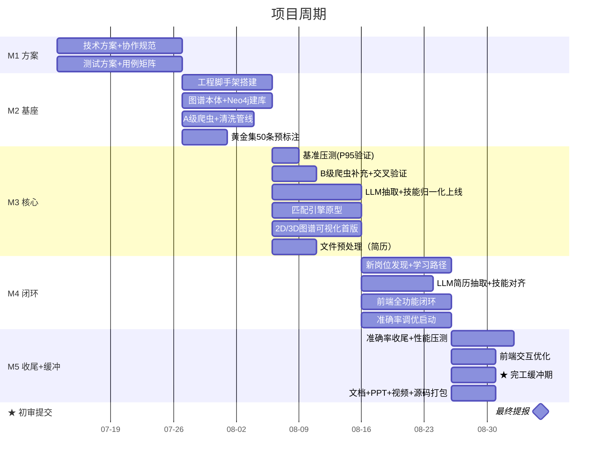
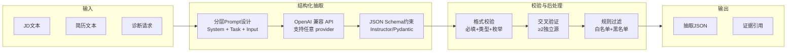

# 设计文档

> 本文档为系统的整体设计方案，作为开发实施的单一事实源。执行计划与分工见 [执行计划.md](./执行计划.md)。

---

## 目 录

0. [项目概览](#0-项目概览)
1. [项目背景与目标](#1-项目背景与目标)
2. [总体技术架构](#2-总体技术架构)
3. [项目时间节点](#3-项目时间节点)
4. [数据采集与预处理](#4-数据采集与预处理)
5. [知识图谱构建](#5-知识图谱构建)
6. [大模型应用策略](#6-大模型应用策略)
7. [动态演化与新岗位发现](#7-动态演化与新岗位发现)
8. [简历解析](#8-简历解析)
9. [人岗匹配算法](#9-人岗匹配算法)
10. [前端可视化](#10-前端可视化)
11. [系统架构与部署](#11-系统架构与部署)
12. [账户与权限系统](#12-账户与权限系统)
13. [测试与质量保障](#13-测试与质量保障)
14. [测试用例矩阵](#14-测试用例矩阵)
15. [风险与应对预案](#15-风险与应对预案)
16. [合规与伦理保障](#16-合规与伦理保障)
17. [验收标准](#17-验收标准)

> 详细团队分工与执行计划见 [执行计划.md](./执行计划.md)（执行计划）

---

## 0. 项目概览

### 0.1 系统总览



**团队分工**：详见 [执行计划.md](./执行计划.md) 第 1.2 节。6 人分六模块——前端 (黄唐尧)、后端 (马兴达)、算法 (张恺天)、数据 (刘琪)、测试 (王鹏羽)、文档 (张怀伟)。

### 0.2 核心创新点

| 创新点 | 实现方式 | 对应模块 |
|--------|----------|----------|
| **多源交叉验证** | 每个技能实体 ≥ 2 独立源印证（JD + 论文 / JD + GitHub）后才入图谱 | 算法研发 |
| **幻觉防控三道防线** | ① JSON Schema 强校验 ② 跨源交叉验证 ③ 白名单 + O*NET 对齐 | 算法研发 |
| **证据驱动匹配** | 每条匹配断言附带 evidence_id，前端可点击追溯至原始 JD/论文 | 算法 + 前端 |
| **图谱可视化** | ECharts 2D 力导向图为主，react-force-graph-3d (Three.js/WebGL) 作为可选 3D 模式，4 种视图切换 | 前端开发 |
| **静默 Token 续期** | JWT 双 Token + Axios interceptor 自动捕获 401 刷新，用户无感 | 后端开发 |
| **AI 流水线调度** | 系统 cron 编排每日 ETL + ARQ 异步任务队列处理耗时计算 | 后端 + 数据 |
| **技能演化追踪** | 90 天滑动窗口 + 版本快照 + Graph Version Diff，可回溯任意历史版本 | 算法研发 |

### 0.3 关键技术决策

| 选型 | 替代方案 | 选择理由 |
|------|----------|----------|
| Vite + React 19 | Vue 3 / Next.js | 3D 图谱库 react-force-graph-3d 生态最佳（作为可选模式） |
| OpenAI 兼容 API（讯飞星火 / Qwen / GPT / DeepSeek 等） | GPT-4 / 文心 | 统一 OpenAI 接口 + provider 可切换 |
| Neo4j 5 | ArangoDB / JanusGraph | Cypher 社区成熟 + GDS 图算法库 |
| FastAPI | Flask / Django | 异步原生 + Pydantic 校验 + OpenAPI 自动生成 |
| ECharts + react-force-graph-3d（可选） | G6 / D3.js | 2D 力导向图为主，3D 模式可选启用 |

**关键决策**：

1. **前后端通过接口契约协作**：`.yml` 契约文件先行约定 → 前后端并行开发 → 契约测试验证一致性
2. **前端 Token 维护策略**：access_token 存 httpOnly Cookie（后端 Set-Cookie），refreshToken 存前端内存变量，Axios interceptor 处理自动续期
3. **长耗时任务异步化**：简历解析、匹配计算等耗时操作通过 ARQ 异步队列处理，前端轮询 task_id 获取结果
4. **图谱渲染策略**：默认 2D 力导向图（ECharts），3D 模式（react-force-graph-3d）作为可选增强，WebGL2 不可用时自动降级至 2D
5. **LLM 多 provider 同步重试链**：放弃本地 Ollama fallback（CPU 推理 30-60s 与超时阈值冲突 + GPU 硬件不确定），改用多 provider 同步重试链（在 `configs/llm_providers.yaml` 中配置、不限定厂商，后续支持管理员前端调整）。同步路由超时即报错（10s 上限），异步任务按优先级依次尝试（90s 上限）
6. **FastAPI 同端口托管前端**：移除 Nginx，FastAPI 通过 `StaticFiles` 挂载前端构建产物，中间件承担 CORS/CSP/HSTS/gzip。服务数从 6 降为 4（api/postgres/redis/neo4j）
7. **压测决定验收标准**：M3 初（8/06-8/08）统一基准压测 panorama/Neo4j Cypher/全文检索/pgvector 四类 P95 指标，按分档预案处理（达标保留 / 500ms-1s 调整为 < 1s / > 1s 优化查询）。压测报告作为验收标准最终依据

---

## 1. 项目背景与目标

### 1.1 项目意义与社会价值

本项目响应国家从"人口红利"向"人才红利"转型的战略需求。在"新质生产力"与"人工智能+"行动的双轮驱动下，以新一代信息技术为核心的数字经济正深刻重塑产业格局。然而，技术迭代速度远超人才培养周期——大模型、Agent、RAG 等方向每季度涌现新范式，而高校专业培养以 4 年为周期，导致**结构性供需错配**日益严峻。

本系统的社会价值体现在三个层面：

1. **对求职者**：打破"不知道学什么"的信息壁垒，以技能级全景图谱指引职业发展方向，提供个性化学习路径规划，让新兴领域青年与新就业形态劳动者有据可依。
2. **对企业**：解决"招不到合适的人"的困境，通过动态感知技术趋势，提前识别新兴岗位需求，降低招聘与培养成本。
3. **对行业**：构建可自我进化的"人才能力大脑"，实现从"静态画像"到"动态感知"的跨越，为数字经济时代的人才战略提供科学基础设施。

### 1.2 行业痛点

当前招聘市场面临四大核心矛盾：

1. **结构性供需错配**：技术迭代速度（AI/大模型每季度出现新方向）远超高校人才培养周期（4年本科），企业「招不到合适的人」与青年「不知道学什么」并存。
2. **数据时滞与噪声**：招聘JD普遍存在滞后（沿用3年前的要求）、抄袭（同质化严重）、通胀（虚高要求），传统关键词匹配无法感知真实技术趋势。
3. **能力幻觉风险**：大模型在生成岗位定义和技能抽取时易虚构技能项，缺乏科学性与可追溯性，直接损害图谱公信力。
4. **匹配粗放**：传统人岗匹配仅停留在「关键词命中」层面，缺乏细粒度（技能点级）的差距诊断与个性化的学习路径规划。

### 1.3 系统目标

构建一套**可追溯、可验证、可动态更新**的「人才能力大脑」，以证据节点为核心，实现以下六项能力：

**岗位范围**：立足数字经济发展，聚焦新一代信息技术领域（围绕人工智能、大数据、智能系统、物联网等），兼顾国际国内数据对比。

| 能力 | 描述 | 量化目标 |
|------|------|---------|
| 新岗位发现 | 基于多源趋势监测，提前识别产业化拐点，定义新兴岗位 | 候选岗位置信度 ≥ 0.8 |
| 能力动态演化 | 90天滑动窗口追踪技能频次变化，自动识别新兴/衰退技能 | 版本快照按需可回溯 |
| 图谱可视化 | 2D 力导向图为主（3D 可选），展示岗位-技能-证据关系，四种视图切换 | ≥ 100节点 @ 60fps，≥ 200节点 @ 30fps |
| 简历解析 | 支持PDF/Word/图片，大模型结构化抽取 | 准确率 ≥ 90% |
| 人岗匹配 | 三维加权匹配 + 差距分析 + 学习路径推荐 | 准确率 ≥ 90% |
| 证据追溯 | 每条技能断言挂载证据节点，端到端可追溯 | 引用覆盖率 100% |

### 1.4 非功能需求规格

> 本节系统化整合散见于各章的非功能需求指标，作为验收与压测的统一基线。

#### 1.4.1 性能需求

> **压测验证说明**：以下 P95 指标为目标值，最终验收值以 M3 初（2026-08-06 至 2026-08-08）统一基准压测结果为准。压测覆盖 panorama 端点、Neo4j Cypher 查询、Neo4j 全文检索、pgvector 向量检索四类场景，使用 Locust 100 并发。压测结果按分档预案处理：P95 达标则保留原指标；500ms-1s 区间内调整为 < 1s；> 1s 需优化查询或调整 limit 默认值。压测报告写入 `docs/perf_baseline_{date}.md`，验收标准随之同步更新。

| 场景 | 指标 | 目标值 | 验证方法 |
|------|------|--------|---------|
| 图谱 3D 渲染 | 帧率 | ≥100 节点 @ 60fps；≥200 节点 @ 30fps | Chrome DevTools Performance |
| 同步 API 查询 | P95 响应时间 | < 500ms（待压测验证） | Locust 100 并发压测 |
| 图谱 panorama 端点 | P95 响应时间 | < 500ms（30s Redis TTL 缓存命中后 < 100ms；冷启动回源 Neo4j 待压测） | Locust 100 并发压测 |
| 匹配推理（单岗位） | P95 响应时间 | ≤ 2s | Locust 100 并发压测 |
| 批量推荐（全量岗位） | P95 响应时间 | ≤ 5s（异步任务） | ARQ 任务计时 |
| pgvector 向量检索 | P95 延迟 | < 300ms（待压测验证） | pgvector EXPLAIN ANALYZE + Locust |
| Neo4j Cypher 查询 | P95 延迟 | < 500ms（待压测验证，超阈值触发优化） | GDS query log + Locust |
| Neo4j 全文检索 | P95 延迟 | < 500ms（待压测验证） | Neo4j PROFILE + Locust |
| 预计算缓存命中 | 响应时间 | < 100ms | Redis 监控 |
| 并发承载 | 100 并发错误率 | < 1% | Locust 压测 |
| 接口限流 | 普通 / LLM | 100 req/min / 10 req/min | 令牌桶中间件 |
| 数据采集 | 单日 JD 采集量 | P0 ≥ 100 条/日，P1 ≥ 200 条/日 | ARQ 仪表盘 |

#### 1.4.2 可用性需求

| 指标 | 目标值 | 实现方式 |
|------|--------|---------|
| LLM API 可用性 | 主 API 故障自动切换 | 多 provider 同步重试链（主讯飞 → 备 DeepSeek → 三 Qwen，见 6.5） |
| 数据源容灾 | 单源失效不影响整体 | 多源交叉验证 + 单源降权 + 备用源激活 |
| 图谱更新时效 | T+1 更新 | 每日 05:00 前发布新版本（见 7.1） |
| ARQ 任务容错 | 失败自动重试 | 每 task 最多 2 次重试 + webhook/邮件告警 |
| 版本回溯 | 快照保留 90 天 | PostgreSQL `graph_versions` 表 JSONB 字段存储 `graph_v{date}.json` |
| 服务健康检查 | 4 服务健康状态 | Docker Compose healthcheck + `/health` 端点 |

#### 1.4.3 安全需求

| 安全维度 | 指标 | 实现方式（详见 11.2） |
|---------|------|---------------------|
| 认证 | JWT 双 Token（access 30min + refresh 7d） | RS256 非对称签名 |
| 授权 | RBAC 三角色（admin/user/guest） | `graph:read` / `resume:upload` / `match:run` 权限粒度 |
| 限流 | 令牌桶 + IP 级别 | 普通 100 req/min, LLM 10 req/min |
| 数据脱敏 | 日志自动替换 | 身份证/手机/邮箱正则脱敏 |
| 审计日志 | 保留 ≥ 180 天 | 4 分类：AUTH/GRAPH/DATA/ADMIN |
| CORS | 白名单模式 | 生产仅允许前端域名 |
| CSP | Content-Security-Policy | script-src / worker-src / img-src 限制 |
| 密码存储 | bcrypt 加密 | 不可逆存储 |
| 简历数据隔离 | 自动脱敏 + 用户删除权 | PIPL/GDPR 双合规 |

#### 1.4.4 可扩展性需求

| 维度 | 当前规模 | 扩展预案 |
|------|---------|---------|
| 图谱节点 | ≥ 200 节点 | Neo4j 读写分离 → Cluster |
| JD 数据量 | 单日 P0 ≥ 100 条，P1 ≥ 200 条 | PostgreSQL 分区表 + Neo4j 批量入库 |
| 向量索引 | IVF_SQ8（低内存） | 数据量 > 100 万切换 HNSW |
| 用户并发 | 100 并发 | FastAPI 异步 + Redis 缓存 |
| LLM 调用 | 10 req/min | ARQ 队列削峰 + 多 provider fallback |

#### 1.4.5 可维护性需求

| 指标 | 目标值 | 验证方法 |
|------|--------|---------|
| 后端单元测试覆盖 | ≥ 60%（核心 ≥ 80%） | pytest-cov |
| 前端单元测试覆盖 | ≥ 60%（核心 ≥ 80%） | Vitest + @testing-library/react |
| API 集成测试通过率 | 100% | FastAPI TestClient |
| E2E 测试通过率 | 100% | Playwright |
| ESLint | 0 error, 无 `any` 穿透 | CI 检查 |
| TypeScript | strict 模式 | tsconfig 编译 |
| 代码审查 | 算法/安全/业务逻辑 100% 人工审查 | PR Review |

#### 1.4.6 兼容性需求

| 维度 | 目标 | 降级策略 |
|------|------|---------|
| 浏览器 | Chrome/Edge/Firefox 最新版 | — |
| 分辨率 | 1920 / 1280 / 1025 三档布局无错位 | 响应式断点 ≤640 / 641-1024 / ≥1025 |
| WebGL | WebGL2 优先 | 降级至 2D D3.js 力导向图 |
| 移动端 | 基础可读（非主要适配） | ≥1025px 为主 |

#### 1.4.7 数据质量需求

| 指标 | 目标值 | 评测方法 |
|------|--------|---------|
| JD 解析准确率 | ≥ 90% | 100 条标注黄金集 |
| 简历提取准确率 | ≥ 90% | 50 份标注黄金集 |
| 人岗匹配准确率 | ≥ 90% | 100 对匹配黄金集 |
| 实体抽取 F1 | ≥ 0.88 | 200 条标注 JD（黄金集 100 条 JD 解析复用 + 100 条实体抽取专项标注，分批交付：M2 末 50 条、M3 中段 100 条、M3 末补齐 200 条） |
| SimHash 去重准确率 | ≥ 95% | 人工抽检 |
| Spearman 秩相关 | ≥ 0.85 | 100 对黄金集 |
| Top-3 推荐准确率 | ≥ 90% | 简历查询岗位任务 |
| 差距识别准确率 | ≥ 85% | 50 份简历标注 |
| 学习路径合理性 | ≥ 80% | 30 案例专家评审 |
| 新岗位定义采纳率 | ≥ 70% | 人工审核统计 |
| 证据引用覆盖率 | 100% | 自动校验 |
| 跨源置信度 | ≥ 0.6 入图谱 | 每日校验脚本 |

---

## 2. 总体技术架构

### 2.1 五层架构

```
┌─────────────────────────────────────────────────────────┐
│                    应用层（前端）                         │
│  React 19 · 2D/3D图谱 · 简历解析匹配 · 演化看板 · 管理后台    │
├─────────────────────────────────────────────────────────┤
│                    服务层（后端）                         │
│  FastAPI · JWT认证 · RBAC · 限流 · API网关              │
├─────────────────────────────────────────────────────────┤
│                    认知层（算法）                         │
│  OpenAI 兼容 API · RAG · Instructor · Sentence-BERT · BERTopic│
├─────────────────────────────────────────────────────────┤
│                    图谱层（算法）                         │
│  Neo4j · Cypher · GDS · pgvector · 版本管理          │
├─────────────────────────────────────────────────────────┤
│                    数据层（数据）                         │
│  Scrapy · ARQ · SimHash · PostgreSQL · JSONB 快照   │
└─────────────────────────────────────────────────────────┘
```

### 2.2 技术栈选型

| 层级 | 技术选型 | 版本 | 选型理由 |
|------|---------|------|---------|
| 前端框架 | Vite + React + TypeScript | React 19 | 3D图谱库 react-force-graph-3d 生态最优（作为可选模式） |
| 可视化 | ECharts（默认 2D）+ react-force-graph-3d（可选 3D） | — | 2D 力导向图为主，3D 模式可选启用，大节点性能优于G6 |
| 样式 | Tailwind CSS + shadcn/ui | v4 | Utility-first + 可访问性组件库 |
| 状态管理 | Zustand + TanStack Query | v5 | 轻量 + 服务端缓存策略完善 |
| 后端框架 | Python FastAPI + Pydantic | 0.115+ | 异步原生 + 自动OpenAPI文档 |
| 数据库 | PostgreSQL 15 + SQLAlchemy 2.0 | 15 | 关系数据 + 异步驱动支持 + pgvector 向量检索 + JSONB 快照存储 |
| 图数据库 | Neo4j 5.x + GDS | 5.x | Cypher社区成熟 + 图算法库 + 全文索引覆盖中文搜索 |
| 全文检索 | Neo4j Full-Text Index + PostgreSQL tsvector | — | 减少服务依赖，中文搜索通过 Neo4j TEXT INDEX + ik 分词插件覆盖 |
| 向量检索 | pgvector（PostgreSQL 扩展） | 0.7+ | 技能相似度检索 + IVFFLAT 索引（低内存占用 + P95延迟<300ms，数据量 < 10 万场景最优） |
| 缓存 | Redis 7 | 7.x | 缓存 + 限流 + 任务队列 |
| 大模型 | OpenAI 兼容 API（讯飞星火 / Qwen / GPT / DeepSeek 等） | — | 统一接口 + provider 可切换，兼容各类国产/开源模型 |
| 容器化 | Docker + Docker Compose | 24+ | 一键部署4服务 |
| 任务调度 | 系统 cron + ARQ | — | ETL编排 + 异步任务队列 |
| 测试 | PyTest + Vitest + Playwright | — | 全栈测试覆盖 |

### 2.3 API 设计规范

**统一响应格式**：

```json
{
  "code": 0,
  "msg": "success",
  "data": {},
  "trace_id": "a1b2c3d4-e5f6-7890-abcd-ef1234567890"
}
```

**路由命名**：

| 模块 | 前缀 | 说明 |
|------|------|------|
| 认证 | `/api/v1/auth` | 登录/注册/Token刷新/权限 |
| 图谱 | `/api/v1/graph` | 节点/关系CRUD、搜索、视图 |
| 简历 | `/api/v1/resume` | 上传、解析、编辑 |
| 匹配 | `/api/v1/match` | 匹配计算、差距分析、路径 |
| 演化 | `/api/v1/evolution` | 版本管理、Diff对比、趋势 |
| 管理 | `/api/v1/admin` | 用户管理 / 爬取管理 / 岗位审核 / 审计日志 |

### 2.4 API 接口契约总览

> 本节列出全部 REST 端点，作为前后端并行开发的契约基线。详细 Schema 定义存放于 `backend/openapi/` 目录，由 pactman 契约测试保证一致性。

#### 2.4.1 认证模块 `/api/v1/auth`

| 方法 | 路径 | 认证 | 说明 | 请求关键字段 | 响应关键字段 |
|------|------|------|------|------------|------------|
| POST | `/login` | 公开 | 登录获取双 Token | `username`, `password` | `access_token`(Cookie), `refresh_token` |
| POST | `/refresh` | refresh_token | 刷新 access_token | `refresh_token` | `access_token` |
| POST | `/logout` | Bearer | 登出，refresh_token 加入黑名单 | — | — |
| GET | `/me` | Bearer | 获取当前用户信息 | — | `id`, `username`, `role`, `permissions` |
| POST | `/register` | admin | 管理员创建用户 | `username`, `password`, `role` | `user_id` |

#### 2.4.2 图谱模块 `/api/v1/graph`

| 方法 | 路径 | 认证 | 说明 | 请求关键字段 | 响应关键字段 |
|------|------|------|------|------------|------------|
| GET | `/position/{id}` | guest+ | 岗位节点详情 | — | `id`, `name`, `skills[]`, `core_duties` |
| GET | `/position/{id}/skills` | guest+ | 岗位技能列表 | `necessity`(可选) | `[{skill_id, name, necessity, weight}]` |
| GET | `/skill/{id}` | guest+ | 技能节点详情 | — | `id`, `name`, `category`, `description` |
| GET | `/skill/{id}/evidence` | guest+ | 技能证据列表 | — | `[{evidence_id, source, url, confidence}]` |
| GET | `/skill/{id}/prerequisites` | guest+ | 先修技能链 | — | `[{skill_id, name, depth}]` |
| GET | `/skill/{id}/courses` | guest+ | 学习课程列表 | — | `[{course_id, title, platform, hours}]` |
| GET | `/panorama` | guest+ | 全景视图（Neo4j 查询 + 30s Redis 短 TTL 缓存，见 10.3/11.3.5） | `limit`(默认100), `min_weight`(默认0.3) | `{nodes[], edges[], stats}` |
| GET | `/panorama?focus={position_id}` | guest+ | 以某岗位为中心的展开视图 | — | `{nodes[], edges[], stats}` |
| GET | `/view/{view_type}` | guest+ | 视图切换（后端过滤） | `view_type`: panorama/techStack/level/positionCenter | `{nodes[], edges[]}` |
| GET | `/search` | guest+ | 图谱搜索（Neo4j 全文索引） | `q`, `type`, `page`, `size` | `{total, items[]}` |
| GET | `/skill/similar` | guest+ | 相似技能检索（pgvector） | `skill_id`, `top_k` | `[{skill_id, name, similarity}]` |
| GET | `/skill/{id}/positions` | guest+ | 技能反向查询岗位（哪些岗位要求该技能） | — | `[{position_id, name, necessity, weight, level}]` |

#### 2.4.3 简历模块 `/api/v1/resume`

| 方法 | 路径 | 认证 | 说明 | 请求关键字段 | 响应关键字段 |
|------|------|------|------|------------|------------|
| POST | `/parse` | user+ | 上传简历触发解析（异步） | `file`(multipart) | `task_id`（202 Accepted） |
| GET | `/task/{task_id}` | user+ | 查询解析任务状态 | — | `status`, `progress`, `result_ref` |
| GET | `/task/{task_id}/stream` | user+ | SSE 推送任务进度 | — | `event: progress/done/error` |
| GET | `/{resume_id}` | user+ | 获取解析结果 | — | `{name, education, skills[], projects[]}` |
| PUT | `/{resume_id}` | user+ | 编辑简历信息 | `fields` | 更新后数据 |
| DELETE | `/{resume_id}` | user+ | 删除简历 | — | — |

#### 2.4.4 匹配模块 `/api/v1/match`

| 方法 | 路径 | 认证 | 说明 | 请求关键字段 | 响应关键字段 |
|------|------|------|------|------------|------------|
| POST | `/recommend` | user+ | 自动推荐 Top-N（异步） | `resume_id`, `top_n`(默认10) | `task_id`（202） |
| POST | `/compare` | user+ | 人岗比对（单点同步） | `resume_id`, `position_id` | `total_score`, `radar`, `gaps[]` |
| GET | `/task/{task_id}` | user+ | 查询推荐任务状态 | — | `status`, `result[]` |
| GET | `/result/{match_id}` | user+ | 获取匹配结果 | — | `total_score`, `must/nice/exp_score` |
| GET | `/result/{match_id}/gap` | user+ | 获取差距分析 | — | `[{skill, gap_type, priority}]` |
| GET | `/result/{match_id}/path` | user+ | 获取学习路径 | — | `[{skill, prerequisites[], courses[]}]` |
| POST | `/feedback` | user+ | 提交匹配反馈 | `match_id`, `score`(👍/👎) | — |

#### 2.4.5 演化模块 `/api/v1/evolution`

| 方法 | 路径 | 认证 | 说明 | 请求关键字段 | 响应关键字段 |
|------|------|------|------|------------|------------|
| GET | `/versions` | guest+ | 获取图谱版本列表 | `page`, `size` | `[{version_id, created_at, summary}]` |
| GET | `/versions/{version_id}` | guest+ | 获取版本详情 | — | `{nodes_count, edges_count, changes}` |
| GET | `/diff` | guest+ | 版本对比 | `from`, `to` | `{added[], removed[], modified[]}` |
| GET | `/trends` | guest+ | 技能趋势查询 | `skill`, `window`(天) | `[{date, freq, growth_rate}]` |
| GET | `/position/{id}/evolution` | guest+ | 岗位演化历史 | — | `[{version, changes, timestamp}]` |

#### 2.4.6 管理模块 `/api/v1/admin`

| 方法 | 路径 | 认证 | 说明 | 请求关键字段 | 响应关键字段 |
|------|------|------|------|------------|------------|
| GET | `/users` | admin | 用户列表 | `page`, `size` | `{total, items[]}` |
| POST | `/users` | admin | 创建用户 | `username`, `password`, `role` | `user_id` |
| PUT | `/users/{id}` | admin | 更新用户 | `role`, `status` | — |
| DELETE | `/users/{id}` | admin | 禁用用户 | — | — |
| POST | `/crawl/trigger` | admin | 触发爬取任务 | `platform`, `keyword` | `task_id` |
| GET | `/crawl/status` | admin | 爬取状态监控 | — | `[{platform, status, count}]` |
| GET | `/positions/pending` | admin | 待审核岗位列表 | — | `[{position_id, name, confidence}]` |
| PUT | `/positions/{id}/review` | admin | 审核岗位（批准/驳回/编辑） | `action`, `fields` | — |
| GET | `/evolution/pending` | admin | 待审核演化变更 | — | `[{change_id, type, skill, delta}]` |
| PUT | `/evolution/{id}/review` | admin | 审核演化变更 | `action`, `modified` | — |
| GET | `/audit/logs` | admin | 审计日志查询 | `category`, `start`, `end` | `{total, logs[]}` |

#### 2.4.7 统一错误码

| 错误码 | 含义 | 触发场景 | HTTP Status |
|--------|------|---------|-------------|
| 4000 | 参数校验失败 | Pydantic 校验不通过 | 422 |
| 4010 | 未认证 | 缺少/无效 Authorization 头 | 401 |
| 4011 | Token 过期 | access_token 超时，触发刷新 | 401 |
| 4030 | 无权限 | RBAC 权限不足 | 403 |
| 4040 | 资源不存在 | 查询结果为空 | 404 |
| 4290 | 请求限流 | 超过令牌桶阈值 | 429 |
| 5000 | 内部错误 | 未分类异常 | 500 |
| 5001 | Neo4j 查询失败 | 图数据库异常 | 500 |
| 5002 | pgvector 查询失败 | 向量检索异常 | 500 |
| 5003 | LLM 超时 | 大模型调用超时 | 504 |

---

## 3. 项目时间节点



**关键交付物**（2026.09.05 初审提交）：

| 交付物 | 说明 | 负责 |
|--------|------|------|
| 技术方案文档 | 本说明书 v1.0 | 文档 |
| 项目路演PPT | 17页演示文稿 | 文档 |
| 演示视频 | 10分钟，6项核心功能 | 文档 |
| 完整源码 | GitHub仓库 | 全员 |
| Docker部署说明 | DEPLOY.md | 后端 |
| 测试数据集 | 100条标注JD黄金集 | 数据 |
| 评测报告 | 三项准确率≥90% | 测试 |

---

## 4. 数据采集与预处理

### 4.1 多源数据采集

**数据源矩阵**（3 国内 + 4 国际 + 3 社区 + 1 论文 + 3 课程 + O*NET，共 13 源，国内直连 + 国际走网络代理）：

| 分级 | 数据源 | 采集方式 | 频率 | 核心字段 | 代理走向 | 用途 |
|------|--------|---------|------|---------|---------|------|
| **A 级**（P0 主力） | BOSS直聘 | Scrapy + Playwright（公开搜索页） | 每日 | 岗位/薪资/技能/发布时间 | 国内直连 | 基准图谱（国内主源） |
| **A 级** | 智联招聘 | Scrapy（公开搜索页） | 每日 | 同上 | 国内直连 | 交叉验证（国内） |
| **C 级**（P2 实验） | LinkedIn（公开页） | Playwright（公开搜索页） | 每日 ≤ 50 req | 岗位名/公司名/技能标签（不采完整JD文本） | 代理池 | 国际岗位名称对照/跨源验证（仅采公开元数据） |
| **A 级** | Monster | Scrapy + Playwright（公开页 + JSON 嵌入） | 每日 | 岗位/薪资/技能/简历匹配 | 代理池 | 国际专业招聘（IT/工程） |
| **B 级** | Indeed | Scrapy + Playwright（公开搜索页） | 每日 | 岗位/薪资/技能/企业评价 | 代理池 | 国际综合招聘（覆盖广） |
| **B 级** | Glassdoor | Playwright（公开页 + 登录弹窗处理） | 每日 | 岗位/薪资/企业评分/面试评价 | 代理池 | 薪资福利/雇主口碑维度 |
| **C 级**（P2 实验） | 脉脉 | Playwright（公开页面，无登录） | 夜间 23:00-06:00，≤ 100 req/h | 公开岗位名/公司名/技能标签 | 国内直连 | 职场社交维度（仅公开可见元数据，S2+S3） |
| — | GitHub | PyGithub 官方 API | 每日 | Stars/Forks/Issues趋势 | 代理池 | 社区热度 |
| — | StackOverflow | Stack Exchange 官方 API | 每日 | 问题/标签热度 | 代理池 | 社区热度 |
| — | arXiv | arXiv 官方 API | 每日 | 论文/引用/分类 | 代理池 | 学术趋势 |
| — | O*NET | O*NET 官方 API | 一次性 | 标准职业分类 | 代理池 | 基线对照 |
| — | 中国大学MOOC | icourse163 公开页面 | 每周 | 课程/技能/讲师/评分 | 国内直连 | 学习路径（国内） |
| — | Coursera | Coursera Partner API | 每周 | 课程/专项证书/合作院校 | 代理池 | 国际学习路径 |
| — | edX | Open edX Catalog API | 每周 | 课程/课程类型/开课时间 | 代理池 | 国际学习路径 |

> **数据源精简说明**：相对原方案移除 Udacity/Khan Academy/Pluralsight 3 个课程平台（边际价值低，Coursera/edX 已覆盖国际课程维度）。M3 阶段若有余力可补充 Udacity 作为工业实战课程维度。
>
> **拉勾网移除（2026-08-01）**：拉勾网破产重组、网页停止维护，招聘数据源已彻底移除，数据源总数 14 → 13（原 B 级国内补充源，无替代必要）。
>
> **网络代理方案（D1b：Rule 模式）**：开发环境配置 网络代理/V2Ray 系统代理（Rule 模式），国内平台（BOSS/智联/脉脉/中国大学MOOC）走 DIRECT 直连，国际平台（LinkedIn/Indeed/Monster/Glassdoor/GitHub/SO/arXiv/O*NET/Coursera/edX）走 Proxy 出口。爬虫代码不感知代理，由 网络代理 在系统层完成分流。网络代理 失效时仅国际平台降级，国内平台不受影响。
>
> **平台 A/B/C 分级管理**：
> - **A 级（P0 主力，稳定源）**：BOSS、智联、Monster —— 3 平台保底 P0 单日 ≥ 60 条
> - **B 级（P1 补充，次稳定）**：Indeed、Glassdoor —— 能跑就跑，失败当日停止
> - **C 级（P2 实验，风险源）**：脉脉、LinkedIn —— 黄金集不依赖
>
> **脉脉采集方式修正**：放弃 H5 接口逆向 + mitmproxy 方案（在 Docker 环境中可行性低），改为 Playwright 采集未登录状态下可见的公开页面内容。仅作为 C 级实验源，不依赖其数据满足 P0 指标。

**爬虫工程参数**：

- **代理方案**：三梯队代理池，爬虫代码不感知代理，由 AdaptiveProxyMiddleware 自动切换
  - 第一梯队（代理池）：Rotating HTTP/HTTPS 代理池（可自建或使用公共代理服务），代理池连续 3 次失败后自动切换
  - 第二梯队（代理池）：PROXY_POOL 列表 + ProxyPoolMiddleware 随机轮换，代理失败自动剔除
  - 第三梯队（直连兜底）：仅对 Monster/Indeed 等部分对国内 IP 友好的国际站点生效；直连也失败则当日停止该源
- User-Agent：300+ 常用 UA 轮换（`scrapy-fake-useragent`）
- 请求间隔：国内平台 8-15s 随机；国际平台 10-20s 随机（保守限频）；LinkedIn 官方 API 按 quota 限流；GitHub/SO/arXiv 按 API 配额（GitHub 5000 req/h、Stack 10000 req/day、arXiv 1 req/3s）
- 增量调度：仅爬取发布时间 ≤ 7 天的新 JD，URL MD5 去重；跨平台相同岗位通过 `(title, company, city)` 三元组二次去重
- 历史数据回爬（M2 启动时一次性执行）：
  对 A 级核心平台（BOSS/智联/Monster），在采集首日回爬 90 天历史 JD 数据，
  用于在 M3 启动时为新岗位发现的 3 月 MA 频次分析提供基线数据。
  回爬限频与增量采集一致，不触发反爬机制。
- 失败处理：429/403 触发指数退避（30s → 60s → 120s → 300s），单日单源连续 3 次失败则该源当日停止采集并告警
- 国际平台降级策略：LinkedIn 优先官方 API，quota 超限时降级至公开职位页（C 级）；Indeed/Monster/Glassdoor 仅爬取无需登录的公开搜索页
- A/B/C 分级运行策略：A 级每日必跑（保底 P0）；B 级每日尝试，失败当日停止；C 级按需运行（脉脉夜间，LinkedIn 公开页仅 API 失效时）

爬虫开发交付节奏（单人多源约束）：M2 已完成 7 招聘源贯通（BOSS/智联/Monster/Indeed/Glassdoor/脉脉/LinkedIn 公开页）+ 清洗管线 + 6 非招聘源（arxiv/github/stackoverflow/icourse163/coursera/edx）；M3 时滞/通胀调优 + LLM 抽取管线；M4 课程平台对接学习路径 + 观察池接入。

**本地限流中间件的配置**：Scrapy 中间件栈含 UA 随机化、单 IP 限流与退避、URL 增量去重三层。完整实现见源码 `backend/data/crawlers/middlewares.py`，核心策略详见上文爬虫工程参数。

**数据采集 P0/P1 指标体系**：

| 指标 | P0（必达） | P1（挑战） | 题目硬性要求 |
|------|----------|-----------|-------------|
| 单日 JD 总量 | ≥ 100 条/日 | ≥ 200 条/日 | — |
| 国内 JD | ≥ 60 条/日 | ≥ 120 条/日 | — |
| 国际 JD | ≥ 40 条/日 | ≥ 80 条/日 | — |
| 国际源占比 | ≥ 30% | ≥ 30% | — |
| 黄金集标注 | M2 末 ≥ 50 条，M3 中段 ≥ 100 条 | M2 末 ≥ 100 条 | **≥ 100 条** |
| SimHash 去重准确率 | ≥ 95% | ≥ 95% | — |

### 4.2 数据清洗管线

**管线顺序**：`raw_JD → 长度过滤 → 核心词检测 → 质量评分 → 去重 → 时效加权 → 结构化输出`

**质量过滤**：长度 < 50 字丢弃、核心词检测、质量评分（字段完整度+文本长度+核心词+格式规范），< 0.6 入人工复核。

**去重**：精确去重（URL+标题+公司名）、SimHash 64-bit 近似去重（汉明距 ≤ 3）、MinHash 兜底，抄袭（≥ 0.85）保留最新版本。

**时效加权**：`weight = 1.0 (≤30天) / exp(-0.01×(days_ago-30)) (>30天)`，输出五标：`publish_time / crawl_time / decay_weight / source_platform / region`。

### 4.3 结构化输出

每条 JD 输出 JSON 格式，含 `job_title / company / salary_range / city / experience_required / education_required / responsibilities / requirements / benefits / publish_time / source_url / decay_weight` 等字段，详见源码 `backend/data/crawlers/schemas/jd_schema.py`。

### 4.4 ETL 调度

系统 cron + ARQ 编排每日管线：`crawl_jds → clean_jds → dedup → validate_temporal → detect_inflation → structure → load_to_db → load_to_es`，异常阈值触发 webhook + 邮件告警。

**数据更新频率**：国内招聘平台每日 02:00/04:00，脉脉夜间 23:00-06:00（≤100 req/h），LinkedIn 每日 UTC 0:00，Indeed/Monster/Glassdoor 错峰，GitHub/SO 每日 UTC 0:00，arXiv 每日 UTC 3:00，课程平台每周日 UTC 2:00 全量同步，时效衰减每日凌晨 4:00 重算。

### 4.5 多平台数据交叉验证

**实体对齐策略**：通过 `(normalized_title, normalized_company, city)` 三元组聚合不同平台同岗位 JD，公司名经 `Sentence-BERT` 编码 + 阈值 0.85 模糊匹配。

**校验维度**：

| 维度 | 校验逻辑 | 处置方式 |
|------|---------|---------|
| 技能一致性 | 必备技能集合跨平台命中 | ≥ 2 源 → `verified`；单源 → `unverified` 进人工审核 |
| 薪资异常 | 同岗位多平台薪资中位数差异 > 50% | 标记 `salary_outlier`，人工复核 |
| 国内外对比 | LinkedIn 与国内平台同岗位技能差异 | 输出 `skill_gap_intl` 报告供算法层调权 |
| 经验要求 | 同岗位经验要求跨平台不一致 | 取众数，标注分歧度 |

**跨源置信度**：融合数据源数量、跨源一致性与时效得分三项因子加权计算，单源数据直接标记为 `unverified`。区分 stable/emerging 岗位设置分级阈值——既有岗位入图谱 ≥ 0.6，新兴岗位下调至 ≥ 0.5 避免误杀新趋势。

**数据准确性校验流程**：每日清洗管线末端执行 `cross_validate.py`，输出 `validation_report_{date}.json`，含校验通过率、异常清单、人工复核队列。

**REQUIRES 边 weight 聚合策略**：增量计算为主（每日仅处理有新增 Evidence 的 Position），全量重算为兜底（每 7 日一次）。

### 4.6 课程质量评估

六维加权评分（平台权威性 0.25/用户评分 0.20/注册量与完成率 0.15/时效性 0.20/技能覆盖度 0.10/实战项目密度 0.10），阈值 ≥ 0.65 进入推荐池。时效性优先近 2 年课程，> 5 年降权 0.5。每月重跑评估管线，学习路径按质量分取 Top-3。

### 4.7 数据时滞专项处理

#### 4.7.1 时滞来源分析

| 时滞类型 | 表现 | 覆盖情况 |
|---------|------|---------|
| **内容时滞** | JD 日期新但技能沿用过时技术 | ❌ 原方案未覆盖，本节补充 SAI 检测 |
| **抄袭时滞** | 抄袭旧 JD 仅改日期 | ⚠️ 原 SimHash 未识别"抄袭+改日期"，本节补充 |
| **发布/处理/展示时滞** | 发布时间、处理耗时、查询差异 | ✅ 已有方案覆盖 |

#### 4.7.2 内容时滞检测算法

**核心思路**：同岗位近期 JD 的技能分布应跟随技术趋势变化。若某条 JD 的技能集合与该岗位近 90 天 JD 集合的中位数技能分布显著偏离，且偏向"老技能"，则判定为内容时滞。

**技能老化指数（SAI）**：`SAI(d) = median(skill_age) of d / median(skill_age) of岗位近 90 天 JD`，其中 `skill_age` 基于 `Skill.first_seen_at` 计算。判定：SAI > 1.5 标记 content_stale（降权 ×0.5），> 2.0 标记 content_obsolete（归档不入聚合）。

**僵尸 JD 检测**：连续 N 个发布周期（默认 N=4，约 4 个月）内，某公司某岗位的 JD 技能集合 Jaccard 相似度 ≥ 0.95（几乎不变），且 SAI > 1.5 → 标记 `zombie_jd`，仅保留最早版本，后续版本降权 ×0.3。

#### 4.7.3 抄袭时滞检测

在 SimHash 去重基础上增加时间维度对齐：若新 JD 与旧 JD 技能集合构成子集关系且发布时间间隔超过 90 天，标记为抄袭改日期，降权 ×0.4 不参与聚合。

#### 4.7.4 时滞控制目标与衡量标准

| 环节 | 时滞类型 | 控制目标 | 衡量标准 |
|------|---------|---------|---------|
| 数据采集 | 处理时滞 | T+1 发布 | 每日 05:00 前完成 ETL |
| 数据清洗 | 内容时滞 | content_stale 占比 < 10% | 每日 `validation_report` 统计 |
| 数据聚合 | 处理时滞 | 聚合耗时 < 30min | ARQ 日志 |
| 数据展示 | 展示时滞 | 图谱直查 Neo4j（无缓存） | API P95 < 500ms |
| 内容质量 | 内容时滞 | SAI > 2.0 的 JD 占比 < 5% | 每周质量报告 |

#### 4.7.5 异步处理优化

内容时滞检测为 ETL 管线中 `validate_temporal` 步骤（`dedup` 之后），SAI 依赖图谱层 `Skill.first_seen_at` 每日 04:30 增量更新。`Skill` 节点存储 `first_jd_at / first_paper_at / first_trend_at` 三个时间戳，聚合取最早非空值，JD 优先。僵尸 JD 检测每周末执行一次。

### 4.8 技能通胀专项处理

针对 JD 中技能要求"虚高"现象（如初级岗要求 10 年大模型经验），从经验、技能数量、技能深度、学历四个维度检测通胀。综合指数 `inflation_score`（四项加权，阈值 0.4/0.7 分三级），高通胀 JD 降权 ×0.4、岗位级通胀（≥30%）排除该 JD 参与聚合、平台级通胀（>50%）触发源降权。M2 起实施，控制目标：通胀检测召回率 ≥ 80%，误报率 ≤ 15%。

---

## 5. 知识图谱构建

### 5.1 本体模型

**实体类型**（9 类，覆盖岗位/技能/证据/课程/原始数据/职业分类/认证/教育/工具）：

| 标签 | 属性 | 说明 | 数据来源 |
|------|------|------|---------|
| `Position` | id, name, level, industry, salary_range, occupation_code | 岗位节点 | JD 抽取 + 国家职业分类 |
| `Skill` | id, name, normalized_name, category, description | 技能节点 | JD/课程/社区抽取 |
| `Evidence` | id, source, url, publish_time, weight, source_type, company, platform, skill_necessity_map | 证据节点（JD作为Evidence，含source_type=jd） | JD/论文/GitHub/SO |
| `Course` | id, title, platform, url, hours, rating | 课程节点 | MOOC 平台 |
| `Occupation` | id, code, name, category, definition | 国家职业分类节点 | 国家职业分类大典（2022）/ O*NET |
| `Certification` | id, name, issuer, level, valid_years | 证书节点 | JD 抽取 + 行业认证库 |
| `Education` | id, level, major, school_tier | 教育要求节点 | JD 抽取 |
| `Tool` | id, name, category, vendor, version | 工具/框架节点 | JD/GitHub 抽取 |

> **国家职业分类数据接入**：`Occupation` 节点以《中华人民共和国职业分类大典（2022 版）》为权威源（共 1639 个职业细类），同时交叉映射 O*NET 标准职业分类（SOC 代码），用于岗位归一化基线对照。数据通过人社部公开 API + O*NET API 一次性导入，每季度校验更新。每个 `Position` 节点通过 `BELONGS_TO_OCCUPATION` 关联至 `Occupation` 节点，确保岗位命名规范与国家分类一致。

**关系类型**（9 类，覆盖要求/证据/先修/学习/演化/归属/相似/替代/职业映射）：

| 关系 | 语义 | 属性 |
|------|------|------|
| `(:Position)-[:REQUIRES]->(:Skill)` | 岗位要求技能 | necessity(must/nice), weight, level |
| `(:Skill)-[:EVIDENCED_BY]->(:Evidence)` | 技能由证据支撑 | confidence, source_type |
| `(:Skill)-[:PREREQUISITE_OF]->(:Skill)` | 技能先修关系 | — |
| `(:Skill)-[:LEARNABLE_VIA]->(:Course)` | 技能可学习 | platform |
| `(:Position)-[:EVOLVED_FROM]->(:Position)` | 岗位演化自 | version, change_type |
| `(:Skill)-[:BELONGS_TO]->(:Skill)` | 父子技能（如 Spring Boot → Java） | — |
| `(:Skill)-[:SIMILAR_TO]->(:Skill)` | 相似技能 | similarity(0.0-1.0) |
| `(:Skill)-[:ALTERNATIVE_OF]->(:Skill)` | 可替代技能（如 React ↔ Vue） | — |
| `(:Position)-[:BELONGS_TO_OCCUPATION]->(:Occupation)` | 岗位归属国家职业分类 | match_confidence |

**Neo4j 约束与索引**（8 类实体共 10 个 UNIQUE 约束，其中 Position 与 Skill 各含 id+name 两个约束 + 7 个索引）：

8 类实体节点均有 UNIQUE 约束（id/name/code），并建有 `skill.category`、`skill.normalized_name`、`position.level`、`evidence.source_type`、`occupation.category` 等 5 个加速索引，以及 Skill/Position 各 1 个全文索引（cjk 分词器覆盖中文搜索）。完整 DDL 见源码 `backend/app/services/kg/schema.cypher`。

### 5.2 实体与关系抽取

**实体抽取管线**（LLM Few-Shot + 词典后过滤）：LLM Few-Shot 抽取（5 条示例 + JSON Schema 强校验）→ 词典后过滤（SKILL_ALIAS 词典扫描 JD，过滤 LLM 越界技能）→ 中文后缀清洗（去除"系统/框架/技术/工程师"等 30+ 后缀）。

**关系抽取**：

- 依存句法分析（HanLP/LTP）+ Prompt 模板
- 识别三类关系：岗位-技能、技能-先修、技能-课程
- 每条关系必须挂载 ≥ 1个 Evidence 节点（来源URL + 发布时间 + 置信度）

### 5.3 技能归一化

Sentence-BERT 编码 → 层次聚类（阈值 0.25）→ 人工词典兜底，输出 `standard_id + confidence`。结果回写至 `Skill.normalized_name`，相似度 ≥ 0.85 时自动建立 `SIMILAR_TO` 关系。

---

## 6. 大模型应用策略

### 6.1 管线架构



### 6.2 Prompt 工程

**分层设计**：System Prompt（角色定义）→ Task Prompt（提取要求）→ Few-Shot Examples（5 条）→ Input。详见源码 `backend/app/services/prompts/`。

**参数配置**：

- `temperature = 0.1`（低随机性保证稳定）
- `max_tokens = 2048`
- `top_p = 0.9`

### 6.3 幻觉防控三道防线

| 防线 | 方法 | 触发条件 | 处理方式 |
|------|------|---------|---------|
| 第一道 | JSON Schema强校验 | 字段缺失/类型错误/枚举越界 | 自动重试1次，失败降级规则提取 |
| 第二道 | 跨源交叉验证 | 实体仅1个数据源出现 | 标记 `unverified`，不入生产图谱 |
| 第三道 | 规则白名单后过滤 | 实体不在500+标准技能白名单中 | 对齐O*NET/Wikidata，未对齐走审核 |

### 6.4 RAG 检索增强

**检索策略**：

- 检索源：图谱中已验证的岗位定义 + 技能描述 + 历史诊断报告
- 检索方法：Neo4j 全文索引（关键词 top-10）+ pgvector 向量检索（语义 top-10），合并去重
- 上下文窗口：截取前3000 tokens，超出丢弃

**生成约束**：仅基于证据生成回答，证据不足时明确说明；每条断言附加 `evidence_id`，虚构引用拦截并重新生成。

### 6.5 LLM API 降级策略

> **决策变更**：原方案使用本地 Ollama + Qwen2.5-7B 作为 fallback。考虑到本地 7B 模型 CPU 推理需 30-60s（与主 API 超时阈值 30s 冲突，fallback 后仍超时）、且需 GPU 才能保证质量（竞赛演示机硬件不确定），改为**多 provider 同步重试链**。

**多 Provider 配置**：

> **决策变更（2026.08.01）**：多 provider 同步重试链机制保留（超时/限流/降级/恢复逻辑不变），但 **provider 组合与优先级不再固定限定厂商**，为运行时可配置项（`configs/llm_providers.yaml` 为单一事实源，可自由增删/调序 provider）。**已实现**：管理员可经管理后台前端页面（`/admin/llm`）直接修改 provider 配置并持久化（admin API 落盘，RBAC `admin:*` 权限，api_key 打码不回显、留空保持原值），无需改代码；配置加载逻辑仍以 yaml 为准。
>
> **决策变更（2026.08.01）**：**LLM 配置（含 api_key）全部落盘 `configs/llm_providers.yaml`，不依赖 env 变量**。该文件已加入 `.gitignore`（防止 key 入库），模板为 `configs/llm_providers.yaml.example`，全新 clone 后复制并经 `/admin/llm` 填写 api_key 即可。

主备三个 provider 均通过 OpenAI 兼容 API 接入，配置存放于 `configs/llm_providers.yaml`，下表为**当前生效的默认组合**（可被管理员后续调整）：

| 优先级（默认） | Provider | 模型 | 适用场景 | 备注 |
|--------|----------|------|---------|------|
| 主 | DeepSeek | deepseek-v4-flash | 全场景（抽取/匹配/诊断） | 支持 function calling |
| 备 | 讯飞星火 | v4.0 | 全场景 | 支持 function calling |
| 三 | Qwen | qwen-plus | 全场景 | 支持 function calling |

**同步重试链策略**（按路由类型区分）：

| 路由类型 | 重试策略 | 超时上限 | 失败处理 |
|---------|---------|---------|---------|
| **同步路由**（图谱查询、诊断报告等） | 主 API 超时 10s → 立即返回 503 错误，前端提示「LLM 暂时不可用，点击重试」 | 10s | 不重试，避免同步阻塞 |
| **异步任务**（ARQ：简历解析、批量抽取、演化计算） | 主超时 30s → 备 30s → 三 30s → 入延迟队列等待恢复 | 90s | 全部失败后任务标记 failed，等待人工介入或定时重试 |

**触发条件**：

| 场景 | 触发条件 | 降级动作 | 恢复条件 |
|------|---------|---------|---------|
| 主 API 超时（>10s 同步 / >30s 异步） | 单次超时 | 同步路由：返回 503；异步任务：切备 provider | 主 API 健康检查连续 3 次 200 |
| 主 API 限流（429） | 单次 429 | 异步任务：指数退避（30s→60s→120s）后切备 provider | 限流解除后自动恢复主 |
| 主 API 不可用（5xx） | 连续 3 次 5xx | 全部切备 provider + 告警 | 主 API 健康检查通过 5min |
| 全链路不可用 | 主+备+三均失败 | 异步任务标记 failed，规则兜底（关键词匹配+模板报告，标 `low_confidence`） | 人工介入后重跑 |

**实现要点**：

- `LLMProviderChain` 类管理 provider 轮换逻辑，读取 `configs/llm_providers.yaml`
- 同步路由调用 `llm.call_sync(prompt)` → 单次尝试，超时即抛 `LLMTimeoutError`
- 异步任务调用 `llm.call_with_fallback(prompt)` → 按优先级依次尝试，全部失败后入延迟队列
- provider 健康检查：每 5min 调用 `/models` 端点验证可用性，结果写入 Redis
- 主 API 恢复后，由 `failed` 状态的异步任务自动重新入队重跑（不污染图谱质量）

---

## 7. 动态演化与新岗位发现

### 7.1 时间窗口演化算法

**增长率计算**：采用**Z-score 统计 + 环比（MoM）辅助**双信号。Z-score 只需 ≥2 个历史窗口即可计算，适配项目 90 天回爬数据周期。

Z-score（标准分）为主要判定信号，`z = (f(t) - μ) / σ`，其中 f(t) 为当前 30 天窗口频次，μ/σ 为历史窗口均值/标准差。判定阈值：`z > 2.0 → emerging`，`z > 1.5 → rising`，`z < -1.5 → declining`。环比（MoM）辅助观察短期方向。频次 < 10 的技能受小基数保护不参与判定，改用 Wilson score 冷启动兜底（见 §7.2.4）。

**版本管理**：

- 每次演化生成 `graph_v{date}.json` 全量快照（APOC），存入 PostgreSQL `graph_versions.snapshot_json` JSONB 字段
- `GraphVersion` 节点记录：version_id, created_at, change_summary, triggered_by
- Diff 对比：set 差集计算新增/删除/变化节点

> **T+1 图谱更新承诺**：岗位图谱遵循 T+1 更新节奏——每日凌晨 4:00 ETL 完成后（爬虫→清洗→去重→结构化→图谱增量同步），于 5:00 前自动发布新版本。用户在每日 5:00 后查询到的图谱数据已包含前一日全部新增/变更 JD 的影响。版本快照保留 90 天，支持任意历史版本回溯对比。

**图算法应用**：

| 算法 | 用途 | 实现 |
|------|------|------|
| PageRank | 技能重要性排序 | `gds.pageRank.stream()` → Top-20 关键技能 |
| Louvain | 技能簇识别 | `gds.louvain.stream()` → 技术栈视图支撑 |
| 最短路径 | 学习路径先修排序 | `shortestPath((:Skill)-[*..6]-(:Skill))` |

#### 7.1.1 既有岗位动态更新示例——以 Java 开发工程师为例

| 时间窗口 | 技能变化 | 类型 | 证据 | 置信度 |
|----------|---------|------|------|--------|
| 2026-Q2 | Spring AI 框架 | 新增 | BOSS+智联 201 条JD，出现频次增长 62%；GitHub Spring AI Stars 突破 35k | 0.89 |
| 2026-Q2 | GraalVM 原生编译 | 新增 | 跨 3 源（JD + GitHub + SO），growth_rate = 78% | 0.82 |
| 2025-Q4 | LLM API 调用能力 | 新增 | 102 条 JD 新增 "AI 集成/大模型调用" 关键词 | 0.76 |
| 2024-Q2 | JSP/Servlet | **衰退** | 连续 3 窗口 decline_rate > 50%，仅出现在 ≤ 5% JD 中 | 0.93 |
| 2025-Q1 | Docker/K8s | **权重提升** | 跨 4 源一致 necessity → must | 0.91 |

### 7.2 新岗位发现

#### 7.2.1 岗位分类标准与状态机

岗位全生命周期采用六状态机模型，增加 `rejected` 态，状态属性持久化至 Neo4j 节点：

| 状态 | 含义 | 进入条件 | 流转方向 | 是否公开 |
|------|------|---------|---------|---------|
| `candidate` | 候选态 | 趋势监测命中规则门控 | → `emerging` / → `rejected` | 否 |
| `emerging` | 新兴态 | 跨 ≥2 独立源验证 + 置信度 ≥ 0.6 | → `stable` / → `declining` | 是 |
| `stable` | 稳定态 | jd_count ≥ 5 + platform_count ≥ 2 + 连续 2 窗口频次波动 < 25% + skill_novelty < 0.3 | → `declining` | 是 |
| `declining` | 衰退态 | 连续 3 窗口频次下降 > 40%（三窗口下降率均值） | → `archived` / → `stable` | 是 |
| `archived` | 归档态 | 人工审核确认衰退（仅曾上线的岗位进入此态） | 终态，可回溯 | 否 |
| `rejected` | 驳回态 | admin 审核驳回 candidate | 终态，不入图谱，仅保留审核日志 | 否 |

**转换条件**：窗口为 30 天滑动窗口。自动转换条件见上表状态机，人工参与仅涉及 candidate→emerging/rejected（admin 审核）和 declining→archived（admin 确认衰退）。

**自动化与人工审核矩阵**：

| 转换 | 自动化 | 人工 | 说明 |
|------|--------|------|------|
| → candidate | ✅ 自动 | — | 每日定时任务，规则门控 |
| candidate → emerging | — | ✅ admin 审核 | 管理后台每周审核队列 |
| candidate → rejected | — | ✅ admin 审核 | 同上 |
| emerging → stable | ✅ 自动 | — | 条件满足即自动迁移，记录日志 |
| emerging → declining | ✅ 自动 | — | 条件满足即自动迁移 |
| stable → declining | ✅ 自动 | — | 条件满足即自动迁移 |
| declining → archived | — | ✅ admin 确认 | 需填写审核理由 |
| declining → stable | ✅ 自动 | — | 条件满足即自动回迁 |

前端演化看板按状态着色：候选-灰 / 新兴-绿闪烁 / 稳定-蓝 / 衰退-橙 / 归档-红 / 驳回-灰透明。

#### 7.2.2 特征提取规则

从多源数据提取 4 项核心特征 + 2 项辅助加分特征作为判定输入：

**核心特征**（4 项，Z-score 门控主判定信号，**仅 JD 源驱动**）：

| 特征名 | 提取方法 | 说明 |
|--------|---------|------|
| `jd_freq_ma3` | PostgreSQL 聚合 + 3 月移动平均 | JD 频次基线 |
| `z_score` | `(f(t) - μ) / σ`，μ/σ 为历史 30 天 JD 窗口统计 | JD 频次异常度，Z-score 主判定信号 |
| `source_diversity` | JD 独立源计数（BOSS/智联/脉脉等） | JD 跨源验证强度 |
| `cross_source_consistency` | 三源 JD 语义相似度均值 | JD 跨源一致性 |

**辅助加分特征**（2 项，参与 candidate→emerging 置信度加成，不作为 candidate 触发门控）：

| 特征名 | 提取方法 | 说明 | 上线阶段 |
|--------|---------|------|---------|
| `arxiv_paper_count` | arXiv API 周论文数 + 引用增长率，`δ > 2σ` 为异常 | 学术关注度信号，验证技术早期学术热点 | M4 |
| `github_star_velocity` | GitHub API Star 增速标准分，`δ > 2σ` 为异常 | 社区活跃度信号，验证技术工业界采纳 | M4 |

> **分层源策略**：
> - **JD 源（招聘平台）**：驱动 candidate 触发。JD z_score 命中即进 candidate 池，遵循 6.3「≥2 JD 源入图谱」门控。
> - **学术/社区源（arXiv/GitHub/SO）**：进入「技术热点观察池」，admin 周报可见，**不独立触发 candidate**。仅在 candidate→emerging 阶段作为置信度加分项。
> - **设计依据**：arXiv/GitHub 是技术热度信号，不是岗位信号。技术热点 ≠ 新职业（如「Spring AI」技术热点与「Spring AI 工程师」新岗位是两个概念）。让技术热点独立触发 candidate 会导致大量假阳性涌入审核队列，admin 负担过重。
> - **观察池升级路径**：观察池中的技术热点若在某周开始出现于 JD（即使频次低），将自动提升为 candidate 候选，进入正式判定流程。

> **辅助加分机制**：两项辅助特征不参与 candidate 触发的硬性判定（避免 M3 未集成时门控失效），但在 candidate→emerging 阶段二置信度计算中作为加分项——当 `arxiv_paper_count` 或 `github_star_velocity` 任一异常（`δ > 2σ`）时，candidate 的置信度 `+0.1`；两者均异常时 `+0.15`（封顶 1.0）。这样学术热点与社区活跃可助推候选岗位进入 emerging，但无法单独促成候选（仍需 JD 频次 + 跨源验证作为基线）。

> **放弃原 12 维特征的原因**：①算法岗 1 人 7 周内无法完成 BERTopic 连贯性、媒介落差指数 MLI 等外部数据源集成（各需 2-3 天）；②80-120 正样本 / 12 维特征，样本/特征比 7:1，低于推荐的 10:1-15:1，逻辑回归严重过拟合；③特征分阶段上线表中 `media_lag`/`industry_adoption` M4 才上线，但阶段一硬阈值依赖这两项，M3 阶段一门控失效。降维为 4 项核心 + 2 项辅助后，保留学术/社区信号参与判定，同时避免硬性门控依赖。

#### 7.2.3 判定流程

**单阶段判定：Z-score 统计门控 + RAG 接地**


```
阶段一（Z-score 统计门控，4 项核心特征，仅 JD 源驱动）：
  IF z_score > 2.0 AND source_diversity ≥ 2 AND jd_freq_ma3 ≥ 10 → candidate
  ELIF z_score > 1.5 AND source_diversity ≥ 2 → candidate（保守观察）
  ELSE → 继续监测

冷启动处理（Wilson score 兜底）：
  历史窗口数据不足 60 天时，z_score 不可靠，改用 Wilson score 二项区间下界。
  wilson_lower > 0.3 AND source_diversity ≥ 3 → candidate（保守判定）
  详见 §7.2.4 置信度计算公式。

阶段二（RAG 接地 + 种子列表匹配，仅对 candidate 触发）：
  candidate → RAG 检索权威岗位库（人社部职业分类 + LinkedIn Emerging Jobs + O*NET）
  IF 匹配权威定义 → 生成岗位定义草案 → admin 审核 → emerging/rejected
  ELIF 匹配种子列表（预置 12 个新兴岗位种子） → 生成岗位定义草案 → admin 审核
  ELSE → 标记 unverified，继续监测
```

> **阶段启用节奏**：
> - **M3 阶段（2026-08-06 起）**：阶段一信号检测全程运行，candidate 候选池开始积累。阶段二 RAG 接地 + admin 审核暂不开放自动 emerging 判定（影子模式），仅人工手动触发用于演示样本生成。
> - **M4 阶段（2026-08-16 起开放）**：阶段二 emerging 自动判定开放。candidate→emerging 流程预计 2-3 天/岗位（RAG 检索 + LLM 生成定义 1 天 + admin 审核 1-2 天），8/28 前预计可产出 1-3 个 emerging。
> - **17.3 测试数据交付策略**：采用双案例——① 预置种子引导案例（M3 期间人工触发全流程产出）；② 真实自动发现案例（M4 自动判定产出）。若真实案例因数据窗口或时点未达 emerging，则交付 candidate 状态 + 声明「已识别但需更多数据确认」，不掩饰。

> **种子列表**：预置 12 个新兴岗位种子（如 AI Agent 工程师、RAG 工程师、大模型应用开发、数据工程师、MLOps 工程师等），参考 talent-graph-system 的 `EMERGING_SEEDS` 模式。种子列表存储在 `configs/emerging_seeds.yaml`，支持运营扩展。

> **RAG 接地**：候选岗位通过 RAG 检索权威岗位库（人社部《国家职业分类大典》、LinkedIn Emerging Jobs 年度报告、O*NET），匹配已确认的新兴岗位定义。检索方法：Neo4j 全文索引（关键词 top-10）+ pgvector 向量检索（语义 top-10），合并去重。匹配后 LLM 聚合技能上下文生成岗位定义草案，参考 talent-graph-system 的 RAG 接地方案。

**稳定化/衰退**：
  emerging → stable: 连续 2 窗口波动 < 20% AND source_diversity ≥ 2
  stable → declining: 连续 3 个 30 天窗口频次下降 > 40%（decline_rate = (prev_freq - curr_freq) / prev_freq）
  declining → stable: 频次回升（z_score > 0 连续 2 窗口）

> **放弃逻辑回归训练数据构造**：原方案的"200 正样本 + 1000 负样本 + 5 折交叉验证 + 正样本双层过滤"整套流程不再需要，节省 ~10 人天。Z-score 无需标注数据，RAG 接地依赖权威文件而非训练数据。

#### 7.2.4 置信度计算公式

> 状态机中 `candidate → emerging` 要求"置信度 ≥ 0.6"，本节给出置信度的显式计算公式，消除阈值表无公式可依的歧义。

**综合置信度**采用三维加权（权重和 = 1.0）+ 学术/社区加分，三个因子均归一化至 [0, 1]：

```python
# 基础置信度（三维加权）
confidence = w_count × norm(jd_count) + w_source × source_diversity + w_growth × norm(growth_rate)

# 默认权重（可由 configs/discovery_weights.json 覆盖）
w_count, w_source, w_growth = 0.4, 0.3, 0.3

# 归一化函数
norm(jd_count)        = min(jd_count / 10, 1.0)        # 10 条 JD 即满分
norm(growth_rate)     = min(growth_rate / 0.5, 1.0)     # 50% 增长率即满分
source_diversity      = min(source_count / 4, 1.0)       # 4 个独立源即满分

# 学术关注度 / 社区活跃度加分（M4 上线后启用，M3 仅用基础置信度）
if arxiv_anomaly and github_anomaly:
    confidence += 0.15  # 学术 + 社区双异常，强信号
elif arxiv_anomaly or github_anomaly:
    confidence += 0.10  # 单一异常，中等信号
confidence = min(confidence, 1.0)  # 封顶 1.0
```

**冷启动兜底（Wilson score 区间）**：当历史窗口数据不足 90 天时，上述频次/增长率因子不可靠，改用 Wilson score 二项区间下界作为保守估计：

```python
from math import sqrt

def wilson_lower(successes, total, z=1.96):
    """Wilson score 95% 置信区间下界（z=1.96 对应 95%）"""
    if total == 0:
        return 0.0
    p = successes / total
    denominator = 1 + z * z / total
    center = p + z * z / (2 * total)
    spread = z * sqrt(p * (1 - p) / total + z * z / (4 * total * total))
    return max(0.0, (center - spread) / denominator)

# 冷启动时：successes = 出现该技能的 JD 数，total = 总 JD 数
# wilson_lower > 0.3 → 可进入 RISING 状态（保守判定）
```

**状态机阈值映射**：

| 状态转换 | 置信度条件 | 说明 |
|---------|-----------|------|
| → candidate | 规则门控命中（不依赖置信度） | 阶段一硬阈值 |
| candidate → emerging | `confidence ≥ 0.6` AND `source_diversity ≥ 2` | 人工审核 + 置信度双条件 |
| emerging → stable | `confidence ≥ 0.8` AND 连续 2 窗口波动 < 25% | 自动迁移 |
| 冷启动兜底 | `wilson_lower > 0.3` → RISING（保守判定） | 数据不足 90 天时启用 |

> **设计依据**：本项目采用 3 因子（频次/源多样性/增长率），与 12 维特征中最重要的 3 项对齐。

#### 7.2.5 趋势监测与岗位定义生成

**条件监测矩阵**：

| 信号源 | 指标 | 阈值 |
|--------|------|------|
| JD频率 | 3月移动平均环比增长率 | > 50% |
| arXiv论文 | 周论文数 + 引用增长率 | 超过历史均值2σ |
| GitHub | Star增速 | δ > 2σ |

**产业化拐点判断**：采用媒介落差指数（MLI）综合论文、课程、社区讨论与招聘平台四维信号，MLI > 0.6 判定为 Ready-to-industrialize，避免学术热点但工业界未跟进的误判。

**岗位定义生成**：RAG 双角色设计——角色一检索图谱检测重复，角色二聚合技能上下文辅助 LLM 生成岗位定义。

#### 7.2.6 评估指标

| 指标 | 目标值 | 评测方法 |
|------|--------|---------|
| emerging 判定 Z-score 准确率 | ≥ 80% | 对照行业报告人工抽检 |
| 新兴岗位召回率 | ≥ 80% | 对照行业报告 |
| 误报率 | ≤ 15% | 季度复盘抽检 |
| 首次出现到 emerging 耗时 | ≤ 60 天 | 系统日志 |
| 岗位定义采纳率 | ≥ 70% | 审核队列通过率 |
| `evidence_refs` 覆盖率 | 100% | 自动校验 |

---

## 8. 简历解析

### 8.1 文件解析

| 文件类型 | 解析库 | 说明 |
|---------|--------|------|
| PDF（文本型） | pypdf + pdfplumber | 优先文本提取，处理段落与表格 |
| PDF（扫描件） | PaddleOCR（ch_PP-OCRv4）+ 预处理 | 图像增强（自适应阈值 + 去噪）→ OCR → 后处理（拼写校正） |
| PDF（双栏版式） | pdfplumber + 布局分析 | `page.search()` + 列边界检测，按阅读顺序重组文本 |
| PDF（表格简历） | pdfplumber + Camelot | 优先检测表格区域，提取后与正文段落合并 |
| Word | python-docx | 直接提取段落、表格与样式 |
| 图片 | PaddleOCR | OCR识别后输入LLM抽取 |

**复杂版式处理流程**：

```
文件上传 → 类型检测 
  ├─ 文本PDF → pypdf 提取 → 若空白则 pdfplumber → 若仍空白则 OCR
  ├─ 扫描件PDF → pdf2image 转图片 → 自适应阈值 + 去噪 → PaddleOCR → 后处理
  ├─ Word → python-docx 提取段落+表格 → 合并为纯文本
  └─ 图片 → PaddleOCR 直接识别
→ 文本串联 → LLM 结构化抽取
```

**双栏简历处理**：通过 pdfplumber 检测中线空白带判定双栏布局，按 y 坐标交替拼接左右栏文本。表格简历使用 Camelot 提取。详见源码 `backend/app/services/resume/reflow.py`。

### 8.2 PII 脱敏预处理

> 简历文本在送入 LLM 抽取前**必须先经 PII 脱敏**，避免敏感信息泄露给外部 LLM API（PIPL/GDPR 合规要求）。

**脱敏规则**（正则替换，脱敏后的占位符保留语义上下文供 LLM 抽取）：

| PII 类型 | 正则模式 | 替换为 | 说明 |
|---------|---------|--------|------|
| 手机号 | `1[3-9]\d{9}` | `[PHONE]` | 11 位中国大陆手机号 |
| 身份证号 | `[1-9]\d{5}(18|19|20)\d{2}(0[1-9]\|1[0-2])(0[1-9]\|[12]\d\|3[01])\d{3}[\dXx]` | `[ID_CARD]` | 18 位身份证 |
| 邮箱 | `[\w\.-]+@[\w\.-]+\.\w+` | `[EMAIL]` | 标准邮箱格式 |
| 中文姓名 | 姓氏词典（百家姓前 100）+ 名字长度 1-2 字 | `[NAME]` | 基于姓氏词典启发式匹配，避免误替换技术名词 |

**脱敏流程**：

```
原始文本 → mask_pii(text) → 脱敏文本 → LLM 抽取 → 结构化数据
                                              ↓
                                      原始文件保留在 PostgreSQL resume_files 表
                                      （仅用户本人可下载，管理员无权访问原文）
```

**实现约束**：
- `mask_pii()` 在 `backend/app/services/resume/pii_mask.py` 实现，单元测试覆盖率 ≥ 90%
- 脱敏映射表（`{placeholder: original}`）仅存于内存，不入日志、不入数据库
- LLM 抽取完成后，`[PHONE]` / `[EMAIL]` 等占位符通过映射表回填至结构化结果
- 日志中所有简历相关字段均经脱敏，审计日志不记录原始 PII

### 8.3 LLM 信息抽取

**提取字段**：姓名、电话、邮箱、教育背景（学校/专业/学历/时间）、工作经历（公司/职位/时间/描述）、项目经验（名称/角色/时间/技术栈）、技能列表（熟练度）、证书

**抽取 Schema**（Pydantic 模型）：

```python
class ResumeModel(BaseModel):
    name: str = Field(..., description="姓名")
    phone: str = Field(..., pattern=r"^1[3-9]\d{9}$")
    email: str = Field(..., pattern=r"^[\w\.-]+@[\w\.-]+\.\w+$")
    education: list[Education]
    work_experience: list[Experience]
    skills: list[str]
    projects: list[Project]
    certifications: list[str]
```

### 8.4 幻觉防控

抽取后的技能点经归一化管线映射至图谱标准实体，未匹配项标记 `unmapped` 走人工确认。

---

## 9. 人岗匹配算法

### 9.1 算法选型与评估

对主流岗位匹配算法进行系统调研与对比评估：

以基于内容的多维加权匹配为主干，融合 Sentence-BERT 语义相似度，规则引擎 + LLM 兜底处理非结构化字段。不采用协同过滤（冷启动严重）和纯深度学习（标注数据不足）。

**匹配模式**：支持两种使用场景——① **自动推荐**：上传简历后系统自动遍历全量岗位，计算综合评分后输出 Top-N 推荐列表（含评分+简要对比）；② **人岗比对**：用户从推荐列表或图谱中手动选择目标岗位，触发详细单点比对（含五维雷达图+差距分析+学习路径）。

### 9.2 画像构建与特征工程

**岗位画像**：

```cypher
MATCH (p:Position {name: $name})-[r:REQUIRES]->(s:Skill)
RETURN s.name, r.necessity, r.weight
```

分组为 `must_have`（necessity=must）和 `nice_to_have`（necessity=nice）

**候选人画像**：

- 技能提取：从简历解析JSON的 `skills` 字段
- 熟练度映射：`精通→3, 熟练/熟悉→2, 了解→1, 项目中使用→2`
- 技能对齐：原始技能名经归一化管线映射至标准ID

**统一特征向量设计**：

| 特征类别 | 岗位侧 | 候选人侧 | 匹配方法 |
|---------|--------|---------|---------|
| 技能 | must/nice + 期望熟练度 + 权重 | 标准 ID + 实际熟练度 | 布尔匹配 + 同义词集 + Embedding 余弦 |
| 经验 | required_years + 行业领域 | total_years + domain_experience | 规则引擎 + 领域命中 |
| 学历 | required_education | education_level + school_tier | 层级映射 + 学校加权 |
| 项目 | typical_scenarios | projects[]（名+栈+描述） | 项目 Embedding 与场景余弦均值 |
| 软技能 | soft_skills[] | 从项目角色推断 | LLM 推断兜底（标 `low_confidence`，Prompt 见下方） |
| 证书 | required_certs[] | certifications[] | 集合交集 |

Prompt 模板见源码 `backend/app/services/prompts/soft_skill_prompt.txt`。调用策略：温度 `T=0.3`，输出经 Schema 校验后写入候选人画像，`low_confidence` 字段在匹配时降权 ×0.5。白名单由岗位本体维护共 20 项软技能。

### 9.3 模型训练方案

三阶段策略：M2 规则基线（三维加权 + 100 对黄金集，目标 Spearman ≥ 0.7）→ M3 语义增强（预训练 Sentence-BERT 直接推理 + Optuna 搜索权重/阈值，目标 ≥ 0.85）→ M5 后持续迭代（Bradley-Terry 反馈学习，数据不足时退化至 Optuna 静态权重）。权重从 `configs/match_weights.json` 加载，不存在时使用默认值 `(0.6, 0.2, 0.2)`。

> **Sentence-BERT 不微调**：100 对黄金集不足以微调（通常需 1000+ 对），仅用于评估（Spearman）+ Optuna 调阈值（`sim_threshold`）。使用预训练模型 `paraphrase-multilingual-MiniLM-L12-v2` 直接推理

### 9.4 匹配计算

> 运行时权重 `(w_must, w_nice, w_exp)` 从 `configs/match_weights.json` 加载（见 9.3 权重加载策略），以下公式使用默认值作为示例。

| 维度 | 方法 | 默认权重 | 说明 |
|------|------|---------|------|
| 必备技能 | `must_score = (matched + synonym) / total` | 0.6 | 同义词集带权相似度映射，matched/total 已天然惩罚缺失 |
| 加分技能 | `nice_score = Σ(sim×weight) / Σ(weight)` | 0.2 | Embedding 余弦 ≥ sim_threshold 视为匹配 |
| 经验级别 | 规则引擎 + LLM 推断兜底 | 0.2 | required_years ≤ candidate → 满分 |


**CII 通胀修正（预处理）**：在匹配计算前，对岗位必备技能列表执行通胀修正。当 `required_count > 7` 时，触发 CII（Capability Inflation Index）降级——按 `(weight, source_count)` 升序排列，将边缘必备项降级为加分技能，避免"初级岗要求 10 年大模型经验"式的虚高要求导致匹配分虚低。

```python
def apply_cii_correction(position):
    if len(position.must_skills) <= 7:
        return position  # 无通胀，直接返回
    # 按权重升序，取最低 20% 降级为 nice
    sorted_must = sorted(position.must_skills, key=lambda s: (s.weight, s.source_count))
    demote_count = max(1, int(len(sorted_must) * 0.2))
    for skill in sorted_must[:demote_count]:
        # 保护机制：高熟练度 + 高 source_count 的核心技能不降级
        if skill.proficiency == "精通" and skill.source_count >= 30:
            continue
        skill.necessity = 'nice'  # must → nice
    return position
```

**必备技能匹配**（`must_score = (full_match_count + synonym_match_score) / total_must_count`）：同义词匹配采用带权相似度映射（别名级 1.0，语义级 0.85-1.0）。`matched/total` 已天然惩罚缺失，无需额外比例惩罚。

**加分技能匹配**（`nice_score = Σ(sim × weight) / Σ(weight)`）：余弦相似度，岗位无 nice 时取 1.0 不扣分。

**四层主权划分**：内容加权决定 must/nice 分数，Sentence-BERT 做语义扩展兜底，规则引擎处理经验/学历/证书，LLM 在画像阶段完成软技能推断——各层决策域互不重叠。

**综合评分**：

```python
# 1. 基础分数
base_total = must_score × w_must + nice_score × w_nice + exp_score × w_exp

# 2. 必备技能全缺失判零
if must_score == 0:
    total = 0.0  # 不纳入推荐排序，前端标记 unqualified
    return total

# 3. 时效衰减（分段）
if last_updated > 365 days:
    staleness_penalty = 0.85
elif last_updated > 180 days:
    staleness_penalty = 0.95
else:
    staleness_penalty = 1.0

# 4. 最终评分（无比例惩罚，must_score 已天然惩罚缺失）
total = base_total × staleness_penalty
```

**评分效果示例**（默认权重 0.6/0.2/0.2，无比例惩罚）：

| 场景 | must_score | nice_score | exp_score | base_total | final total |
|------|-----------|-----------|-----------|-----------|-------------|
| 完美匹配 | 1.0 | 1.0 | 1.0 | 1.0 | **1.00** |
| 缺 1/20 must | 0.95 | 1.0 | 1.0 | 0.97 | **0.97** |
| 缺 5/20 must | 0.75 | 1.0 | 1.0 | 0.85 | **0.85** |
| 缺 5/5 must | 0 | 1.0 | 1.0 | 0.40 | **0.00**（判零） |
| 缺 0 must，低经验 | 1.0 | 1.0 | 0.5 | 0.90 | **0.90** |

> `must_score = matched/total` 已天然惩罚缺失（缺 5/20 → 0.75），无需额外比例惩罚。

**时效衰减系数依据**：分段衰减（180d→0.95，365d→0.85）基于 LinkedIn《Workforce Report》IT 技能半衰期估算，M5 后可接入 Bradley-Terry 反馈动态校准。

**批量推荐逻辑（含粗筛优化）**：
自动匹配模式下：
  Step 1（粗筛）：查询 skill→position_id 倒排索引，根据候选人技能 ID 命中数降序，取 Top-K（K=200）
  Step 2（精算）：仅对 K 个候选岗位跑完整三维评分（含 Sentence-BERT 语义匹配）
  Step 3：按 total DESC 排序截取 Top-N（N 默认 10）
  输出：[{position_id, position_name, total_score, must_score, nice_score, exp_score, summary}]

倒排索引由聚合层每日 05:00 维护：INSERT INTO skill_position_index (skill_id, position_id)
SELECT s.id, p.id FROM skills s JOIN requires r ON r.skill_id = s.id JOIN positions p ON p.id = r.position_id

**缓存策略**：

| 缓存对象 | 基准时长 | 失效条件 | 说明 |
|---------|---------|---------|------|
| 自动推荐Top-N结果 | 1h | 简历或岗位聚合时间更新 | 检查版本号 |
| 人岗比对详细报告 | 24h (max) | 简历或岗位聚合时间更新 | 随模型版本漂移 |
| 图谱全景/视图查询 | 30s（panorama 短 TTL，并发合并） | 每日 05:00 版本发布 | |

所有缓存基于 `(resume_id, position_id)` 或 `(resume_id)` 键值，存储于 Redis，过期自动清除。

### 9.5 差距分析与学习路径

| 差距类型 | 条件 | 显示 |
|----------|------|------|
| missing | 候选人不包含必备技能 | 红色高亮 |
| weak | 包含但熟练度不达标 | 黄色高亮 |
| matched | 匹配成功 | 绿色高亮 |

**差距优先级**：按 `skill_weight DESC, gap_type (missing > weak)` 排序，Top-5 作为重点改进项。

**学习路径生成**：对每个缺失技能，查询图谱获取先修链 → 拓扑排序 → 匹配 `LEARNABLE_VIA` 课程 → 输出甘特图格式 `{skill, prerequisite_chain, recommended_courses[], estimated_hours, priority}`。

**人岗比对模式**：自动推荐列表中的每个岗位提供「详细比对」入口，点击后触发单点 BS 对比（仅需计算一个岗位 + 已缓存的候选人画像），输出完整五维雷达图 + 差距热力图 + 学习路径甘特图 + LLM 诊断报告。比对结果按缓存策略（见 9.4 节）存储。

**诊断报告生成**：LLM 将匹配结果 + 差距 + 路径作为 context 生成 Markdown 报告，结构：① 总体匹配度环形图 ② 三维雷达图解读 ③ 关键差距 Top-5 ④ 学习路径甘特图 ⑤ 改进建议。每条断言附带 `evidence_id` 可点击追溯。报告按缓存策略（见 9.4 节）存储。

### 9.6 评估指标

| 指标 | 目标值 | 评测方法 |
|------|--------|---------|
| Spearman 秩相关 | ≥ 0.85 | 100 对黄金集 |
| Top-3 推荐准确率 | ≥ 90% | 简历查询岗位任务 |
| 差距识别准确率 | ≥ 85% | 50 份简历差距标注 |
| 学习路径合理性 | ≥ 80% | 30 案例专家评审 |
| 推理延迟 P95 | ≤ 2s | Locust 压测 |
| 用户反馈率 | ≥ 30% | 线上统计 |
| `evidence_id` 覆盖率 | 100% | 自动校验 |

---

## 10. 前端可视化

### 10.1 技术栈

| 模块 | 技术 | 说明 |
|------|------|------|
| 框架 | React 19 + TypeScript | 函数组件 + Hooks |
| 构建 | Vite 6 + SWC | HMR热更新 + SWC编译提速 |
| 状态管理 | Zustand + TanStack Query v5 | 6个独立store + 缓存策略 |
| 路由 | React Router v7 | 路由守卫 + 懒加载 |
| 样式 | Tailwind CSS v4 + shadcn/ui | Utility-first 组件库 + 响应式布局 |
| 2D/3D图谱 | ECharts（默认）+ react-force-graph-3d（可选，Three.js/WebGL） | 力导向图 + 节点交互 |
| 图表 | ECharts | 雷达图/折线图/热力图/甘特图 |
| 测试 | Vitest + @testing-library/react | 组件测试 |

### 10.2 页面路由

| 路由 | 组件 | 说明 | 权限 |
|------|------|------|------|
| `/login` | LoginPage | 登录 | guest |
| `/register` | RegisterPage | 注册 | guest |
| `/` | DashboardPage | 仪表盘 | 全部 |
| `/graph` | GraphPage | 2D/3D图谱 | 全部 |
| `/resume-match` | ResumeMatchPage | 简历上传解析 + 自动匹配推荐 + 人岗比对 | auth |
| `/evolution` | EvolutionPage | 演化看板 | 全部 |
| `/profile` | ProfilePage | 个人中心 | auth |
| `/admin` | AdminDashboard | 管理后台仪表盘 | admin |
| `/admin/users` | AdminUsers | 账户管理（创建/编辑/删除/权限分配/状态管理） | admin |
| `/admin/crawl` | AdminCrawl | 爬取管理（手动触发/进度监控/历史记录） | admin |
| `/admin/review` | AdminReview | 岗位审核（查看详情/批准上线/驳回修改） | admin |

### 10.3 图谱交互（2D 为主，3D 可选）

**四种视图模式**（所有视图在后端通过 Neo4j 查询过滤，前端仅渲染返回的数据）：

1. **全景视图**（panorama）：仅返回 Top-N 高频岗位及其关联技能（默认 `limit=100`），附带 `stats` 字段告知总规模。
2. **技术栈视图**（techStack）：由后端执行 Louvain 聚类过滤，仅返回选中技能簇的子图。
3. **级别视图**（level）：后端按 `level` 属性分组过滤，返回选中级别（如"中级"）的岗位-技能关系子图。
4. **岗位中心视图**（positionCenter）：后端以 `{position_id}` 为中心做 k-hop 展开（默认 2 跳），返回邻域子图。

前端 GraphPage 按视图类型请求不同路由：
| 视图 | 路由 |
|------|------|
| panorama | GET /api/v1/graph/panorama |
| techStack | GET /api/v1/graph/view/techStack |
| level | GET /api/v1/graph/view/level |
| positionCenter | GET /api/v1/graph/view/positionCenter?position_id=X |

**数据规模控制**：全景图响应 ≤ 600 节点 / 1500 边（约 200-300KB），2D ECharts 可保证 60fps+，3D 模式可保证 30fps+。超限时提示用户缩小范围。视图基于 Neo4j 实时数据，panorama 端点启用 30s Redis 短 TTL 缓存用于并发合并。

> **T+1 与 30s TTL 的关系**：每日 05:00 发布新版本后，panorama 端点最多有 30s 窗口返回旧缓存数据。T+1 承诺措辞修正为「5:00 后最多 30s 内可见新数据」，明确接受这 30s 最终一致性窗口。30s TTL 仅作用于 panorama 端点，其他图谱查询端点（position/{id}、skill/{id} 等）保留各自缓存策略（见 11.3.5）。

**图谱渲染策略**：默认使用 2D ECharts 力导向图（轻量、兼容性好、性能稳定）；用户可在工具栏切换至 3D 模式（react-force-graph-3d，动态加载，WebGL2 不可用时自动降级至 2D）。3D 模式下节点 > 200 降低力模拟计算。图谱画布占 70-75% 宽度，右侧为节点详情面板。

### 10.4 简历解析与匹配

**页面流程**：同一页面内实现简历上传/解析 → 自动岗位推荐 → 人岗比对的无缝衔接。

**统一界面**：页面左侧为简历上传区（拖拽/点击），上传后自动 LLM 解析 → 右侧卡片列表展示 Top-N 推荐 → 点击展开人岗比对分析报告（含环形图/雷达图/热力图/甘特图/诊断报告）。

### 10.5 响应式适配与移动端策略

三断点布局：桌面端（≥ 1025px）双栏/三栏全功能（支持 2D/3D 切换），平板端（641-1024px）单栏 + 2D 图谱，移动端（≤ 640px）纯单栏 Tab 导航 + 2D 图谱。触摸事件统一使用 `onPointerDown`。

### 10.6 用户体验设计

**设计原则**（对标竞赛用户体验 15 分评分标准）：

- **信息层级**：核心数据（图谱总览/匹配得分/差距 Top-5）始终可见，次要信息（证据明细/历史版本）通过点击下钻，操作路径 ≤ 3 步可达任何功能
- **操作连续**：简历上传 → 解析 → 匹配推荐 → 人岗比对全流程在同一页面内无缝闭环（/resume-match），关键帧不跳转页面
- **可视化优先**：匹配结果以环形图（总分）/雷达图（五维）/热力图（技能矩阵）/甘特图（学习路径）4 种图表展示，数据变化以颜色编码（绿升/红降/灰不变）
- **反馈及时**：耗时操作（简历解析/匹配计算）展示进度条 + 预估剩余时间；操作失败（网络/反爬/API 限流）以 Toast 提示 + 具体原因 + 重试按钮
- **错误预防**：文件上传前校验格式与大小（PDF/Word/图片 ≤ 10MB），填写表单时实时校验格式，图谱切换视图时保持选中节点不丢失

---

## 11. 系统架构与部署

### 11.1 容器化部署

> **服务数变更**：原方案 5 服务（api/nginx/postgres/redis/neo4j）+ 本地 Ollama 共 6 服务。考虑到 ① 本地 Ollama 已在 6.5 移除（改多 provider fallback）；② Nginx 仅做静态资源托管 + 反向代理，FastAPI 可通过 `StaticFiles` + 中间件承担。移除 Nginx 后为 **4 服务**，FastAPI 同端口托管前端静态资源与 API。

**Docker Compose 服务列表**（4 服务）：

| 服务 | 镜像 | 依赖 | 说明 |
|------|------|------|------|
| `api` | 自定义 FastAPI | postgres, redis, neo4j | 后端服务 + 前端静态资源托管（StaticFiles） |
| `postgres` | pgvector/pgvector:pg15 | — | 关系数据库 + pgvector 向量检索扩展（一份镜像承载双能力） |
| `redis` | redis:7-alpine | — | 缓存 + 限流 |
| `neo4j` | neo4j:5 | — | 图数据库 + 全文索引 |

**FastAPI 托管前端实现要点**：

- 通过 `app.mount("/", StaticFiles(directory="frontend/dist", html=True))` 挂载前端构建产物
- API 路由前缀 `/api/v1/*` 优先匹配，未命中转 StaticFiles
- 中间件承担：CORS 白名单、CSP/HSTS 响应头注入、gzip 压缩
- 生产环境 TLS 由部署平台负载均衡层终止（如需本地 HTTPS，通过 `uvicorn --ssl-keyfile --ssl-certfile` 启用）

**部署命令**：

```bash
cp .env.example .env
# 编辑 .env 填写 LLM_API_KEY、JWT_SECRET_KEY 等敏感变量
docker compose up -d
# 验证健康状态
curl http://localhost:8000/health
```

**环境变量**：含数据库（PostgreSQL/Redis/Neo4j）、LLM 多 provider 配置（providers 列表 + 各自 base_url/api_key/model）、JWT（key path/expire）、告警 webhook 等配置。详见源码 `.env.example`。

### 11.2 安全体系

> **实现层变更**：原方案 Nginx 承担 CSP/HSTS/CORS/gzip/TLS 等响应头与传输层安全。Nginx 移除后，这些职责由 **FastAPI 中间件** 承担，TLS 由部署平台负载均衡层终止。

| 安全维度 | 实现方案 | 说明 |
|---------|---------|------|
| 认证 | JWT双Token (access 30min + refresh 7d) | RS256非对称签名 |
| 授权 | RBAC权限模型 | `graph:read` / `resume:upload` / `match:run` 等 |
| 限流 | 令牌桶 + IP级别 | 接口100req/min, LLM接口10req/min |
| 脱敏 | 日志正则替换 | 身份证/手机/邮箱自动脱敏 |
| 审计 | 4分类审计事件 | AUTH/GRAPH/DATA/ADMIN, 保留≥180天 |
| CORS | FastAPI `CORSMiddleware` 白名单模式 | 生产仅允许前端域名（同源时可不启用） |
| CSP | FastAPI 中间件注入 `Content-Security-Policy` 响应头 | script-src / worker-src / img-src 限制 |
| HSTS | FastAPI 中间件注入 `Strict-Transport-Security` | 仅生产环境启用，开发环境跳过 |
| gzip | FastAPI `GZipMiddleware` | 响应体 > 1KB 自动压缩 |
| TLS | 部署平台负载均衡层终止 | 本地开发可选 `uvicorn --ssl-keyfile --ssl-certfile` |

### 11.3 后端与算法集成

#### 11.3.1 集成架构总览

后端（FastAPI）与算法模块（`backend/app/services/`）采用**同进程 Python 包调用 + ARQ 异步任务队列**的混合集成模式，通过共享数据层（Neo4j / PostgreSQL + pgvector）解耦读写。

客户端请求 → FastAPI 路由层（鉴权/限流/审计）→ Service 层（同步 import 或 ARQ 异步投递）→ 算法层 / ARQ Worker → 共享数据层（Neo4j / PostgreSQL + pgvector / Redis）。

#### 11.3.2 集成模式分类

按计算耗时与并发特征，算法调用分为三类模式：

| 模式 | 适用场景 | 响应时间 | 实现方式 | 示例接口 |
|------|---------|---------|---------|---------|
| **同步直接调用** | 轻量查询、已缓存计算 | < 500ms | `from algorithm.kg import crud; crud.get_position(id)` | `GET /api/v1/graph/position/{id}` |
| **异步任务队列** | LLM 调用、批量计算 | 3s - 5min | ARQ 投递任务，前端轮询/SSE 获取结果 | `POST /api/v1/resume/parse` |
| **预计算 + 缓存** | 高频访问的聚合结果 | < 100ms | 定时任务预计算，Redis 缓存 | `GET /api/v1/graph/panorama` |

#### 11.3.3 同步直接调用：Service 层 import 算法模块

**职责边界**：
- 算法岗负责 `backend/app/services/` 包内的函数实现与单元测试。
- 后端岗负责 `backend/app/services/` 中的封装层，处理鉴权、审计、缓存、异常转换。

**算法模块接口规范**：算法岗在 `backend/app/services/` 包中实现函数，后端岗在 `backend/app/services/` 中封装鉴权、缓存与异常转换。接口契约通过类型注解和文档字符串约定，详见源码 `backend/app/services/kg/crud.py` 与 `backend/app/services/graph_service.py`。

**路由层调用示例**：
```
GET /graph/position/{position_id} → GraphService.get_position() → crud.get_position()
```
中间经过 Redis 缓存查写、审计日志记录，最终由 `backend/app/api/v1/graph.py` 中 FastAPI router 注册。

#### 11.3.4 异步任务队列：ARQ 处理耗时算法

**适用场景**：LLM 抽取、简历解析、批量匹配、演化计算等 > 3s 的耗时操作。

**数据流**：`POST /api/v1/resume/parse` → ARQ 入队（status=pending）→ 返回 task_id（202 Accepted）→ ARQ Worker 消费 → 调用 `algorithm.resume.parse` → 写入结果 → 客户端轮询或 SSE 接收。任务类型包括简历解析（3-10s）、LLM 抽取（5s+）、演化计算（60s+），详见源码 `backend/app/workers/tasks.py`。

task_status 表结构见 11.4.1 PostgreSQL 表结构。

#### 11.3.5 预计算与缓存策略

高频访问的聚合结果由定时任务预计算，Redis 缓存。缓存键含 `graph:panorama`(30s)、`position:{id}`(5min)、`match:cache:...`(24h)、`skill:normalize:{text}`(7d)、`search:es:{query_hash}`(10min)，写操作主动失效缓存键，下次读自动回源。

> **panorama 30s TTL 决策依据**：原方案中 2.4.2/9.4 写「无缓存直查 Neo4j」、10.3 写「30s TTL」、本节原写「1h TTL」三处口径不一致。考虑到 T+1 更新模型下同日数据不变，30s TTL 不破坏实时性感知，统一为 30s。冷启动首次请求回源 Neo4j（P95 待 M3 初压测验证），后续 29s 内缓存命中 < 100ms。

#### 11.3.6 错误处理与降级策略

**LLM 调用降级链**（与 6.5 节一致）：多 provider 同步重试链（主讯飞 → 备 DeepSeek → 三 Qwen）+ 异步任务延迟队列重试 + 规则兜底返回 `low_confidence` 标记，前端降级展示。

**算法调用异常处理**（后端 Service 层统一处理）：

| 异常类型 | HTTP 状态码 | 错误码 | 处理策略 |
|---------|-----------|--------|---------|
| Neo4j 连接失败 | 503 | 5001 | 返回降级数据或缓存 |
| pgvector 查询超时（> 5s） | 504 | 5002 | 降级到 Neo4j 关键词搜索 |
| LLM 调用超时（> 30s） | 504 | 5003 | 触发降级链（见上） |
| 算法模块抛出 ValueError | 400 | 4001 | 返回参数错误详情 |
| 算法模块抛出其他异常 | 500 | 5000 | 记录日志，返回通用错误 |

**ARQ 任务重试策略**：单 Worker 并发上限 10，超时 5min，失败重试 2 次，退避 10s。详见源码 `backend/app/workers/config.py`。

#### 11.3.7 性能与超时控制

| 调用类型 | 超时阈值 | 限流 | 缓存 |
|---------|---------|------|------|
| Neo4j 查询 | 200ms（P95） | 100 req/min | Redis 5min |
| Neo4j 全文检索 | 500ms（P95） | 100 req/min | Redis 10min |
| pgvector 向量检索 | 300ms（P95） | 50 req/min | Redis 10min |
| LLM 抽取（异步） | 30s/次 | 10 req/min/用户 | 不缓存 |
| 匹配计算（异步） | 60s/次 | 5 req/min/用户 | 24h |
| 演化计算（异步） | 300s/次 | 1 req/day（定时） | 1h |

**熔断器**（基于 `circuitbreaker` 库）：连续 5 次失败触发熔断，30s 后半开试探。

#### 11.3.8 接口契约与协作流程

**前后端 + 算法三方协作流程**：算法岗定义接口签名 → 后端岗封装 Service + API 并生成 OpenAPI 文档 → 前端岗基于契约 Mock 先行开发 → 三方联调 → 测试岗验证。接口变更须更新 `docs/CHANGELOG.md` 并在 PR 中 @相关负责人。

#### 11.3.9 集成测试要求

| 测试类型 | 范围 | 工具 | 负责人 |
|---------|------|------|--------|
| 算法单元测试 | `backend/app/services/` 内函数 | PyTest | 张恺天 |
| 后端单元测试 | Service 层 Mock 算法 | PyTest + responses | 马兴达 |
| 集成测试 | 后端 ↔ 算法 ↔ Neo4j/PostgreSQL | testcontainers | 王鹏羽 |
| 契约测试 | API 响应符合契约 | pactman | 马兴达 + 黄唐尧 |
| E2E | 全流程闭环 | Playwright | 王鹏羽 |

**集成测试环境**（testcontainers）：通过 `Neo4jContainer` + `PostgresContainer` 容器化启动依赖，执行端到端断言。详见源码 `backend/tests/integration/test_graph_integration.py`。

### 11.4 数据模型设计

> 本节定义 PostgreSQL 关系表（含 pgvector 向量列）、Neo4j 全文索引与 Redis 键空间。Neo4j 图谱 schema 见第 5.1 节。

#### 11.4.1 PostgreSQL 表结构

| 表名 | 用途 | 关键字段 |
|------|------|---------|
| `users` | 用户账户 | id, username, password(bcrypt), role, status |
| `audit_logs` | 审计日志 | user_id, event_type, action, detail, ip |
| `task_status` | 异步任务状态 | task_type, status(pending→running→succeeded/failed), progress, result_ref |
| `resume_cache` | 简历解析缓存 | file_path(本地卷), parsed_json(JSONB) |
| `match_results` | 匹配结果 | resume_id, position_id, total/must/nice/exp_score, gaps_json |
| `match_feedback` | 用户反馈 | match_id, score(👍/👎) |
| `jd_raw` | 原始 JD 数据 | source_platform, raw_text, structured_json, publish_time, decay_weight, confidence |
| `skill_synonyms` | 技能同义词词典 | standard_name, alias, confidence |
| `graph_versions` | 图谱版本快照 | version_tag, snapshot_json(JSONB), nodes/edges_count |
| `rejected_changes` | 驳回变更记录 | change_type, target_id, proposed_json, reviewer_id, reason |

所有表包含 `created_at` / `updated_at` 时间戳，外键关联至 `users(id)`。完整 DDL 见源码 `backend/migrations/`。

#### 11.4.2 Neo4j 全文索引

两个全文索引（替代原 ES 索引方案）：

- `jd_index`：对 `Evidence` 节点的 `raw_text`、`job_title`、`company`、`city`、`skills` 字段建立 Neo4j TEXT INDEX，使用 `cjk` 分词器覆盖中文搜索。
- `skill_index`：对 `Skill` 节点的 `name`、`normalized_name`、`category`、`aliases` 字段建立 TEXT INDEX。

> 优势：减少一个独立服务（Elasticsearch），数据一致性由 Neo4j 单一存储保证，避免 JD 入库后再同步 ES 的延迟。Cypher 通过 `db.index.fulltext.queryNodes('jd_index', $q)` 调用全文检索。

#### 11.4.3 pgvector 向量集合（PostgreSQL 表）

| 表名 | 维度 | 索引类型 | 度量方式 | 用途 |
|------|------|---------|---------|------|
| `skill_embeddings` | 384 | IVFFLAT | Cosine | 技能相似度检索（Sentence-BERT MiniLM） |
| `project_embeddings` | 384 | IVFFLAT | Cosine | 项目与岗位场景匹配 |
| `jd_embeddings` | 384 | HNSW | Cosine | JD 语义去重辅助 |

> 索引参数：IVFFLAT `lists=100, probe=10`；HNSW `m=16, ef_construction=64`。pgvector 在数据量 < 10 万时性能与 Milvus 相当，但减少一个独立服务（Milvus + etcd + minio 依赖）。表结构：`id UUID, embedding vector(384), metadata JSONB`。

#### 11.4.4 Redis 键空间设计

| 键模式 | 类型 | TTL | 用途 |
|--------|------|-----|------|
| `position:{id}` | String(JSON) | 5min | 岗位节点缓存 |
| `match:recommend:{resume_id}` | String(JSON) | 1h | 自动推荐 Top-N 结果 |
| `match:compare:{resume_id}:{pos_id}` | String(JSON) | 24h | 人岗比对详细报告 |
| `rate:{ip}:{route}` | String(int) | 60s | 令牌桶限流计数 |
| `blacklist:refresh:{token}` | String | 7d | 登出 refresh_token 黑名单 |
| `arq:queue` | List | — | ARQ 异步任务队列 |
| `task:progress:{task_id}` | Hash | 1h | 任务实时进度 |

---

## 12. 账户与权限系统

### 12.1 角色体系

| 角色 | 权限范围 |
|------|---------|
| `admin` | 全部权限（账户管理、爬取管理、岗位审核、审计日志查看） |
| `user` | 图谱查看 + 简历上传 + 匹配诊断 |
| `guest` | 图谱只读（未登录访客） |

### 12.2 管理后台

| 功能 | 说明 |
|------|------|
| **账户管理** | 用户 CRUD、RBAC 权限分配、启用/禁用，密码 bcrypt 加密存储 |
| **爬取管理** | 手动触发各平台爬取、WebSocket 实时进度推送、历史记录与异常告警 |
| **岗位审核** | 待审核列表 → 展开详情 → 批准上线/驳回修改，已审核记录追溯 |
| **岗位人工编辑** | 审核员可直接编辑岗位定义：技能列表增删、necessity(must/nice)切换、weight 调整（0.0-1.0）、core_duties/scenarios 文本修改；所有改动写入 `PositionEditLog` 节点，附审核员 ID + 时间戳 + diff 摘要 |
| **演化审核** | 7.1 演化算法输出的技能新增/衰退/权重变更建议，由审核员在新岗位审核界面上确认：可接受/拒绝/修改阈值；拒绝项进入 `rejected_changes` 表，避免重复触发 |

**岗位审核与人工编辑流程**：审核员查看待审核列表后，可执行直接批准、驳回或人工修改（技能列表增删、权重调整、文本编辑），所有操作写入 `PositionEditLog` 节点支持版本回溯。

### 12.3 认证流程

JWT 双 Token（access 30min + refresh 7d），Axios interceptor 自动捕获 401 并静默续期。登出时 refresh_token 加入 Redis 黑名单。路由层通过 `<AuthGuard>` 组件实现鉴权与权限校验。

---

## 13. 测试与质量保障

### 13.1 测试金字塔

单元测试 70%（PyTest + Vitest）、集成测试 20%（API + 数据库）、E2E 10%（Playwright）。

### 13.2 测试覆盖

| 测试类型 | 框架 | 覆盖目标 | 阈值 |
|---------|------|---------|------|
| 后端单元 | PyTest + pytest-cov | 算法/路由/工具函数 | ≥ 60%（核心 ≥ 80%） |
| 前端单元 | Vitest + @testing-library/react | 组件渲染/交互/状态 | ≥ 60%（核心 ≥ 80%） |
| API集成 | FastAPI TestClient | 所有端点正反用例 | 100% 通过 |
| 数据库集成 | testcontainers | ORM/Cypher/ES查询 | 100% 通过 |
| E2E | Playwright | 全流程闭环 | 100% 通过 |
| 性能 | Locust | 100并发P95 < 2s | 错误率 < 1% |

### 13.3 准确率评测

| 评测项 | 黄金集规模 | 评测方法 | 目标 |
|--------|-----------|---------|------|
| JD解析 | 100条标注 | 字段级对比(job_title/responsibilities/requirements/skills) | ≥ 90% |
| 简历提取 | 50份标注 | 字段级对比(name/education/experience/skills/projects) | ≥ 90% |
| 人岗匹配 | 100个匹配对 | 系统匹配分 vs 人工标注分（误差≤10分视为准确） | ≥ 90% |

**统一评测命令**：`python scripts/evaluate.py --task all`，输出 `reports/eval_{date}.html`（含分项得分+错误分析+混淆矩阵）。黄金集 JSON Lines 格式见源码 `backend/tests/evaluate/evaluate.py`，指标为字段级 F1（JD/简历）与 Spearman 秩相关 + Top-3 准确率（人岗匹配）。

---

## 14. 测试用例矩阵

> 本矩阵覆盖系统 7 大核心能力模块的端到端验证，用例按模块分层编排。编号规则：`TC-{模块缩写}-{序号}`。
> 详细执行计划见执行计划.md。

完整测试用例矩阵见 `backend/tests/test_cases.md`，共 43 条覆盖 DC/KG/PD/EV/RM/HL/SI 七个模块。

---

## 15. 风险与应对预案

> 本章集中呈现项目执行期间可能面临的五类风险及其应对措施，作为各章节散落风险点的统一索引。

### 15.1-15.5 风险总览

| 类别 | 风险 | 概率 | 影响 | 应对 |
|------|------|------|------|------|
| 技术 | LLM API 不可用 | 中 | 高 | 多 provider 同步重试链（主讯飞→备DeepSeek→三Qwen） |
| 技术 | 准确率不达标 | 中 | 高 | Optuna 重搜 + 扩大黄金集 |
| 技术 | Neo4j/pgvector 瓶颈 | 低 | 中 | 索引优化 + 参数调优 |
| 数据 | 爬虫被封禁 | 中 | 中 | 退避降频 → 官方 API → 当日停止 |
| 数据 | 数据质量/时滞/通胀 | 中-高 | 中 | SAI/通胀检测 + 降权 + 告警 |
| 外部 | API quota/反爬升级 | 中 | 中 | 降级公开页 + 退避 + 切换备用源 |
| 人员 | 单点过载/请假 | 中-高 | 高 | A/B 角制 + 代码 Review + 文档完备 |
| 合规 | 爬虫 ToS/个人信息 | 中-低 | 高-极高 | robots.txt + 脱敏 + 隔离 + PIPL/GDPR |

---

## 16. 合规与伦理保障

### 16.1-16.4 合规与伦理总览

- **数据来源**：仅采集公开 JD/课程元数据/GitHub 数值趋势，遵循 robots.txt + 请求间隔 ≥ 8s，仅用于学术研究
- **个人信息保护**：简历数据隔离存储 + 敏感字段脱敏 + HTTPS/TLS 1.3 传输 + 审计日志 ≥ 180 天 + 支持删除权
- **AI 伦理**：幻觉三道防线 + `evidence_id` 可追溯 + AI 内容标注 + 人工审核 + 偏见检测（敏感词 < 5%，性别词差 < 10%）+ 可解释性推理链
- **知识产权**：MIT/Apache 2.0 许可，JD 文本用于非商业学术研究，开源模型注明出处

---

## 17. 验收标准

### 17.1 量化目标与评分维度

| 指标 | 目标 | 对应维度 |
|------|------|---------|
| JD/简历/匹配准确率 | 均 ≥ 90% | 技术创新性 + 实用价值 |
| 全流程闭环 | 采集→图谱→匹配→推荐 | 作品完整性(30分) |
| Docker 部署 | 4 服务可启动（api/postgres/redis/neo4j，FastAPI 托管前端） | 作品完整性 |
| 图谱流畅度 | 2D 模式 ≥ 100节点@60fps，3D 模式 ≥ 200节点@30fps | 用户体验(15分) |
| 前端响应 | 首屏 < 3s, 交互 < 200ms | 用户体验 |
| 单元测试覆盖率 | ≥ 60% | 作品完整性 |
| 幻觉防控 | 100% 实体有证据引用 | 技术创新性(25分) |
| 文档完整性 | 全章节覆盖 | 提交规范 |

### 17.2 技术方案可迁移性说明

| 迁移维度 | 通用性说明 | 迁移成本 |
|---------|-----------|---------|
| 图谱本体模型 | 8 类实体 + 9 类关系不绑定特定技术领域，`Position`/`Skill`/`Evidence` 语义通用 | 零改动 |
| 数据采集管线 | Scrapy 爬虫框架支持新增数据源，仅需配置 Spider 规则与代理 | 低（配置级） |
| 清洗与去重 | SimHash/MinHash/时效加权算法与领域无关 | 零改动 |
| 实体抽取 | LLM Few-Shot + 词典后过滤通用，需更新技能同义词词典 | 低（数据级） |
| 技能归一化 | 预训练 Sentence-BERT 多语言模型通用，需更新技能白名单与同义词词典 | 低（数据级） |
| 匹配引擎 | 三维加权匹配 + 语义增强不依赖特定岗位领域知识 | 零改动 |
| 新岗位发现 | Z-score 统计 + RAG 接地 + 种子列表均领域无关，需更新种子列表 | 低（数据级） |
| 前端可视化 | 四视图模式 + 3D/2D 降级策略通用 | 零改动 |

**迁移步骤**：① 配置目标领域 Scrapy Spider → ② 更新技能同义词词典与白名单 → ③ Neo4j 重新建库 → ④ 更新新兴岗位种子列表。预计迁移周期 1-2 周。

### 17.3 测试数据提交规范（1 个新岗位 + 1 个既有岗位）

**交付时间**：M5 第 3 天（08.28）前完成 1 个新岗位和 1 个既有岗位的能力图谱及岗位数据源（含输入输出示例）。AI 辅助生成输入输出示例（JSON），人工校验数据准确性。

> **新岗位演示策略**：采用**双案例**交付，规避 90 天数据窗口 + 12 天判定窗口的时点风险：
> - **主交付（预置种子引导案例）**：从预置 12 个新兴岗位种子中选取 1 个（如「大模型应用工程师」），M3 期间人工触发全流程产出（JD z_score 检测 → candidate → RAG 接地 → LLM 生成定义 → admin 审核 → emerging）。声明「种子为引导，岗位定义由系统 RAG + LLM 生成，非人工预置结果」。
> - **加分项（真实自动发现案例）**：M3 8/06 起跑信号检测，M4 8/16 开放 emerging 自动判定后，由系统自动产出。若 8/28 前真实案例未达 emerging，则交付 candidate 状态 + 声明「已识别但需更多数据确认，受限于 90 天数据窗口」。不掩饰时点风险。
> - **评委问答预案**：若评委追问「这个新岗位是系统发现的还是人工预置的？」，主交付案例回答「种子为引导，系统完成信号检测、RAG 接地、岗位定义生成全流程；定义由 LLM 基于证据库生成，非人工撰写」；加分案例回答「完全由系统自动发现，无人工引导」。

按照赛题要求，提交测试数据必须包含 1 个新岗位和 1 个既有岗位的能力图谱及岗位数据源（含输入输出示例）。

**既有岗位示例：Java 开发工程师**

输入（岗位数据源）：

```
数据来源：BOSS直聘 + 智联招聘（90 天窗口内）
有效 JD 数量：≥ 50 条（经质量过滤）
输出格式：JSON（见 4.3 结构化输出 Schema），每条含五标字段
```

输出（能力图谱 + 更新说明）：

```json
{
  "position_name": "Java开发工程师",
  "update_version": "2026-Q2",
  "must_have_skills": [
    {"name": "Java", "necessity": "must", "weight": 1.0, "evidence_count": 48},
    {"name": "Spring Boot", "necessity": "must", "weight": 0.95, "evidence_count": 45},
    {"name": "MySQL", "necessity": "must", "weight": 0.90, "evidence_count": 42}
  ],
  "nice_to_have_skills": [
    {"name": "Docker/K8s", "necessity": "nice", "weight": 0.70, "evidence_count": 30}
  ],
  "changes": [
    {"type": "added", "skill": "Spring AI", "evidence_refs": ["ev_boss_1203", "ev_zhilian_0456"]},
    {"type": "added", "skill": "GraalVM", "evidence_refs": ["ev_boss_0891", "ev_github_spring"]},
    {"type": "removed", "skill": "JSP/Servlet", "evidence_refs": ["ev_decline_001"]},
    {"type": "weight_up", "skill": "Docker/K8s", "old_necessity": "nice", "new_necessity": "must"}
  ],
  "update_summary": "Java开发工程师 (2026-Q2): +GraalVM, +SpringAI; -JSP/Servlet; ↑Docker(→must)"
}
```

**新岗位示例：大模型应用工程师**——输入为多源 JD/论文/GitHub 信号，输出含岗位名称/状态/置信度/核心职责/必备与加分技能/典型场景/证据引用/区分特征。详见源码 `backend/app/services/evolution/sample_position.json`。

---

## 附录：置信度阈值统一表

| 阈值 | 数值 | 阶段 | 未满足处置 |
|------|------|------|-----------|
| 数据源入图谱 | ≥ 0.6 | 4.5 交叉验证 | 不入生产图谱 |
| 高可靠标记 | ≥ 0.7 | 4.5 交叉验证 | 标记高可靠 |
| emerging 判定 | ≥ 0.6 | 7.2.1 状态机 | 保持 candidate |
| LLM 自评 | ≥ 0.85 | 7.2.3 Z-score 门控 | 0.6-0.85 人工审核 |
| 岗位定义质量 | ≥ 0.8 | 7.2.5 定义生成 | < 0.8 人工审核 |
| 跨源验证 | ≥ 2 源 | 6.3 幻觉防控 | 标记 unverified |
| 课程质量 | ≥ 0.65 | 4.6 课程评估 | 不进推荐池 |
| 抄袭判定 | ≥ 0.85 | 4.2 去重 | 保留最新版本 |
| 技能相似度 | ≥ 0.85 | 5.3 归一化 | 不自动建边 |
